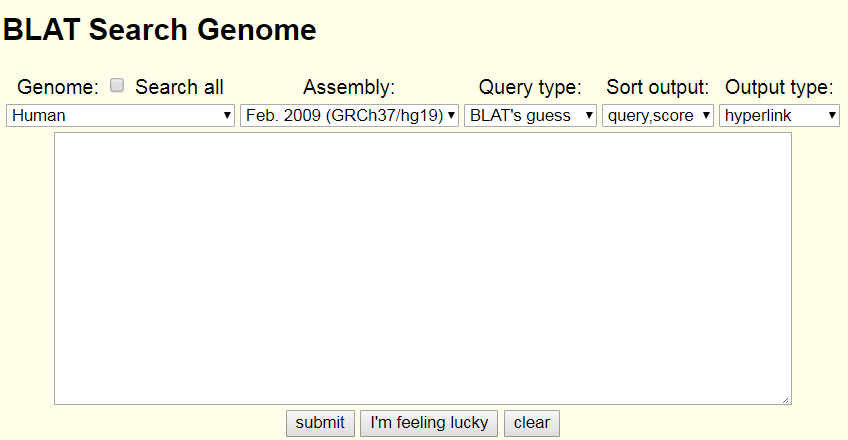
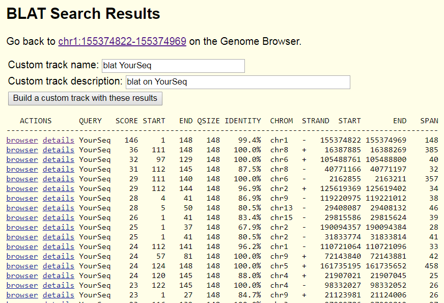
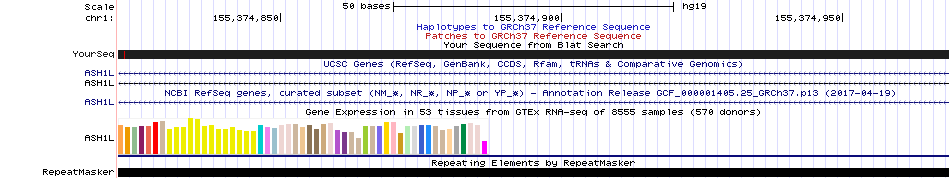
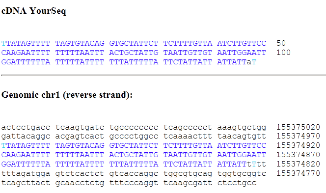
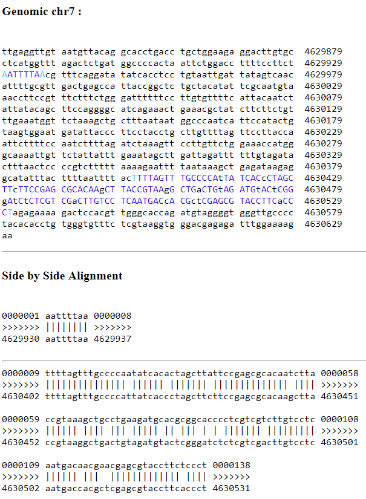

### Preparation

1. To use installed softwares, you need to run 
```
. "/shared/miniconda3/etc/profile.d/conda.sh"
conda activate base
```

Conda is an open source package management system and environment management system that runs on Windows, macOS and Linux. Conda quickly installs, runs and updates packages and their dependencies. Conda easily creates, saves, loads and switches between environments on your local computer. It is especially useful when working in cloud computing settings to ensure that programs can run in different environments. For most of the exercises that we will do in the next a few days, we will use `conda` to manage the software packages.

You will see that your command line prompt is now changed to something that look like `(base) [biouser@test-0010 ]$ `. This indicates that you are already in the "base" environment in conda, and we can proceed with the exercise. Note that many software tools are already pre-installed within the "base" environment, so that you can directly run these software tools without installation.

2. Prepare folders

2.1 Go to your home folder (you can type `cd` to automatically go to your home folder, and `mkdir -p ~/project/startup/` folder, and then `cd ~/project/startup/`. All our tests will be done in this directory.

2.2 `ln -s /shared/data/practice_data data` to link the fq, bam and vcf files for practice.

If you forgot about the `mkdir`, `cd` and `ln` commands, you can always check the [/day1_linux/Linux_Basics.md](/day1_linux/Linux_Basics.md) tutorial.

### Practice basic commands for fq and fa files

Examine the first two reads in a fastq file.
```
head -n 8 data/sr.chr1.2mb_1.fq
```

The `head` command is described in the Linux_Basics.md tutorial as well. The command above prints the first 8 lines of the file called `data/sr.chr1.2mb_1.fq`.

The output is below:

```
@HISEQ1:9:H8962ADXX:1:1101:1283:41924
TTATAGTTTTTAGTGTACAGGTGCTATTCTTCTTTTGTTAATCTTGTTCCCAAGAATTTTTTTTTAATTTACTGCTATTGTAATTGTTGTAATTGGAATTGGATTTTTTATTTTTATTTTTTTATTTTTATTCTATTATTATTATTAT
+
CCCFFFDEHHHHHEGGHGFHJEFHHIJJIJJJJJJJJJIIGGIJIHHCIIDDB?DGFIHJEFHIFFEFFFCCEA>CCCDC@C;@C>CCB?@@CDDDDACCCCCCDDDDD?CDEED<CDEEDDB8ACEEC8AC:B:>@4@C:@>4@B>C
@HISEQ1:9:H8962ADXX:1:1101:1403:46126
AAGTAGCTGGGATTACAGGTGTATGCCACCACGCCTGGCTAATTTTTGTATTTTTAGTACAGACTGGGTTACGCCAGGTCTTGAACTCCTGGCCTCAAGTGATCCGCCCACTCTGGCCTCCCAAAGTCCTGGGATTACAGGCGTGAGC
+
@??DDBDDHFF;FGHGFH@ICEFEBHFHIIIIBDBH?@;?DHEHBBG6B@FHIIG=FFHBAA7CCEHD@AAA;?<8>A6@>@>5;CCCCCCC?A:5:AA4:+4>A18?9.8?AC@::8:<A??CA?(::@@C(8@C4>>C9?<))++9
```

The output contains information on two sequence reads, as described in class. Review the content of each of the four lines for each read.

Count the number of reads in a FASTQ file (divide the line number by 4):

```
[biouser@main-lx startup]$ wc -l data/sr.chr1.2mb_1.fq
```

---

Convert fq to fa
```
cat data/sr.chr1.2mb_1.fq | paste - - - - | cut -f 1,2 | sed 's/^@/>/' | tr "\t" "\n" > sr.chr1.2mb_1.fa
```

The above command represents an easy and fast way to convert FASTQ file to FASTA file with standard Linux commands. Note that `sed` is used to replace the `@` to `>` character.

Now use the `less sr.chr1.2mb_1.fa` command to examine the content of the output file, and press "q" to quite the screen. (If you forget about the `less` command, review the [/day1_linux/Linux_Basics.md](/day1_linux/Linux_Basics.md) tutorial.

---

Next we take the first read, and see whether we can use Genome Browser to locate it in the human genome. To do this, we can open a web browser such as Chrome, go to http://genome.ucsc.edu, then click "Genomes" -> "Human GRCh37/hg19", to show the genome browser for the GRCh37 coordinates. Now you can click "Tool" in the top menu and select "Blat", to see the Blat page as below. 



We then input the first read into this box, "TTATAGTTTTTAGTGTACAGGTGCTATTCTTCTTTTGTTAATCTTGTTCCCAAGAATTTTTTTTTAATTTACTGCTATTGTAATTGTTGTAATTGGAATTGGATTTTTTATTTTTATTTTTTTATTTTTATTCTATTATTATTATTAT", and see what comes out of it. Many genomic positions can have mapping to this read, but only the first hit to "chr1   -   155374822 155374969" has the highest matching scores (146, with 99.4% identity) In addition, the query size is only 148bp, and the first and last base is 1 and 148 respectively, meaning that this read is fully mapped to the database. The actual results are shown below:



Click the first link with the highest sore with "browser" action, you will now see where this read is located exactly in the genome, like below:



but if you select the "details" action, you will see how this read compares with a portion of the genome base by base:



---

Since there are a few reads that are not mapped to the chr1 2Mb region in chromosome 1, we want to check where they came from (could be from a different chromsome) and whether they can still be partially mapped to a specicific region with high mismatch rates. We take the first sequence from the above run as an example `samtools view data/chr1.2mb.mp2.bam | awk '{if (and($2,4)) print NR" : "$0}' | head -n 1`. Then manually use Blat to analyze this sequence "AATTTTAATTTTAGTTTGCCCCAATATCACACTAGCTTATTCCGAGCGCACAATCTTACCGTAAAGCTGCCTGAAGATGCACGCGGCACCCCTCGTCGTCTTGTCCTCAATGACAACGAACGAGCGTACCTTCTCCCTCGAGCAAAGC". You will see that it actually matches to a region in chromosome 7, but it has a split reads that creates a large deletion of ~400bp in the alignment.




### Practice basic commands for bam/sam files

A formal documentation for SAMtools can be found [here](http://www.htslib.org/doc/samtools.html). After running the exercises below, you may want to read the documentation, test other arguments, and play around with the files yourself.

We will use a small BAM file, which contains aligned sequences in a 2Mb region in chromosome 1, for this exercise.

Get basic statistics from a bam
```
samtools stats data/chr1.2mb.mp2.bam | grep ^SN | cut -f 2-
```

The expected results are given below:

```
raw total sequences:    1210338
filtered sequences:     0
sequences:      1210338
is sorted:      1
1st fragments:  605169
last fragments: 605169
reads mapped:   1197138
reads mapped and paired:        1183962 # paired-end technology bit set + both mates mapped
reads unmapped: 13200
reads properly paired:  1106334 # proper-pair bit set
reads paired:   1210338 # paired-end technology bit set
reads duplicated:       0       # PCR or optical duplicate bit set
reads MQ0:      1978    # mapped and MQ=0
reads QC failed:        0
non-primary alignments: 0
total length:   179130024       # ignores clipping
total first fragment length:    89565012        # ignores clipping
total last fragment length:     89565012        # ignores clipping
bases mapped:   177176424       # ignores clipping
bases mapped (cigar):   175426403       # more accurate
bases trimmed:  0
bases duplicated:       0
mismatches:     771150  # from NM fields
error rate:     4.395861e-03    # mismatches / bases mapped (cigar)
average length: 148
average first fragment length:  148
average last fragment length:   148
maximum length: 148
maximum first fragment length:  148
maximum last fragment length:   148
average quality:        34.1
insert size average:    547.5
insert size standard deviation: 158.5
inward oriented pairs:  587439
outward oriented pairs: 2517
pairs with other orientation:   3154
pairs on different chromosomes: 0
percentage of properly paired reads (%):        91.4
```

You can also use `flagstat` to get a quick statistics on the flags in the file:

```
samtools flagstat data/chr1.2mb.mp2.bam
```

The expected output is below:

```
1213010 + 0 in total (QC-passed reads + QC-failed reads)
0 + 0 secondary
2672 + 0 supplementary
0 + 0 duplicates
1199810 + 0 mapped (98.91% : N/A)
1210338 + 0 paired in sequencing
605169 + 0 read1
605169 + 0 read2
1106334 + 0 properly paired (91.41% : N/A)
1183962 + 0 with itself and mate mapped
13176 + 0 singletons (1.09% : N/A)
0 + 0 with mate mapped to a different chr
0 + 0 with mate mapped to a different chr (mapQ>=5)
```


Check a few reads which failed to align in a bam
```
samtools view data/chr1.2mb.mp2.bam | awk '{if (and($2,4)) print NR" : "$0}' | less
```

Find FLAG distribution in a bam
```
samtools view data/chr1.2mb.mp2.bam | cut -f 2 | sort | uniq -c
```

Check those alignment whose mapping quality > 30.
```
samtools view data/chr1.2mb.mp2.bam | awk '{if ($5>30) print $0}' | less
```

Check the read alignment distribution according to chromosomes.
```
samtools view data/chr1.2mb.mp2.bam | cut -f 3 | sort | uniq -c
```

You can check the original SAMtools documentation to understand the results more. For example, this command creates the following output:
```
     24 *
1212986 1
```

So what do the 24 and 1212986 mean?


### Practice basic commands for bcf/vcf files

There are several BCF and VCF files that we prepared in the `data` directory. The files contains variant calls on the 2Mb region in chromosome 1.

Get only snps or indels and check the content of the file:
```
bcftools view -v snps data/mp2.bcftools.call.bcf | less
bcftools view -v indels data/mp2.bcftools.call.bcf | less
```

Notice the differences in the columns that describe REF and ALT alleles in these two files.


Get snps and indels whose coverage > 30
```
bcftools view -i 'MIN(DP)>30' data/mp2.bcftools.call.bcf | less
```

Get snps and indels whose coverage > 30 and quality > 10
```
bcftools view -i 'QUAL>10 & MIN(DP)>30' data/mp2.bcftools.call.bcf | less
```

Get genotype not '1/1'
```
bcftools view -i 'GT!="1/1"' data/mp2.bcftools.call.bcf | less
```

## Advanced practice of processing VCF files

You can use tabix to extract subsets of the vcf files from the 1000genomes websites or other large databases hosted online. Thanks to the fact that tabix uses a index file, you will be able to download only portions of the files, without having to download everything to your local computer.

```
tabix -h ftp://ftp-trace.ncbi.nih.gov/1000genomes/ftp/release/20130502/ALL.chr1.phase3_shapeit2_mvncall_integrated_v5a.20130502.genotypes.vcf.gz 1:155259084-155271225 > 1000G_PKLR.vcf
```

This command takes the genomic region "1:155259084-155271225" (in hg19 coordinate) from the 1000 Genomes Project website and save it as the 1000G_PKLR.vcf file.

The input file is hosted in the FTP server contains the 1000 Genomes Project phase3 release of variant calls. This variant set contains 2504 individuals from 26 populations.

Sometimes, due to network problems, the program above does not return a result within a few minutes. In that case, do not worry about it, just stop the program (pressing "Ctrl+C" will stop the program). We already saved a copy of the output file in `/shared/data/VCF/1000G_PKLR.vcf`, and we can just use this file in the following steps.

Next, we want to extract a few samples from the VCF file.
```
bcftools view -s HG00376,NA11933,NA12282 /shared/data/VCF/1000G_PKLR.vcf > test1.vcf
```

In the output VCF file, the original INFO field from the original VCF file is still present. We want to remove the INFO field:

```
bcftools annotate -x INFO test1.vcf > test2.vcf
```

Now examine the new vcf file, you can see that the INFO field is no longer there.


```
bcftools view --min-ac=1 test2.vcf > test3.vcf
```

Now examine the new vcf file, you can see that the INFO field is updated with the AC and AN.

```
#CHROM  POS     ID      REF     ALT     QUAL    FILTER  INFO    FORMAT  HG00376 NA11933 NA12282
1       155260382       rs61755431      C       T       100     PASS    AC=3;AN=6       GT      1|0     1|0     0|1
1       155260780       rs576493870     AAAT    A       100     PASS    AC=3;AN=6       GT      0|1     0|1     0|1
1       155265177       rs2071053       A       G       100     PASS    AC=1;AN=6       GT      0|0     0|1     0|0
1       155266335       rs8177968       C       T       100     PASS    AC=1;AN=6       GT      0|0     0|1     0|0
1       155268120       rs12067675      T       C       100     PASS    AC=1;AN=6       GT      0|0     0|1     0|0
1       155268425       rs12741350      C       T       100     PASS    AC=1;AN=6       GT      0|0     0|1     0|0
1       155268958       rs11264357      C       T       100     PASS    AC=1;AN=6       GT      0|0     0|1     0|0
1       155269776       rs3020781       A       G       100     PASS    AC=1;AN=6       GT      0|0     0|1     0|0
```

So now we have 8 sites that are polymorphic in the VCF file (in other words, we found eight SNPs that have mutations in at least one of the three subjects.)

You can make a statistics on the test3.vcf file:

```
bcftools stats test3.vcf
```

We will see the information below:

```
# SN    [2]id   [3]key  [4]value
SN      0       number of samples:      3
SN      0       number of records:      8
SN      0       number of no-ALTs:      0
SN      0       number of SNPs: 7
SN      0       number of MNPs: 0
SN      0       number of indels:       1
SN      0       number of others:       0
SN      0       number of multiallelic sites:   0
SN      0       number of multiallelic SNP sites:       0
```

Among the 8 variants, 7 are SNPs and 1 is an indel.

Of couse, BCF has more advanced functions, you can probably explore these advanced functions yourself using the manuals at [here](http://www.htslib.org/doc/bcftools.html). In later exercises, we will come back to bcftools again to compare VCF files.


### For other practice

To do other tutorial, you might need to run `conda deactivate` to get out of the base environment. You might have errors if you do not deactivate the environment first.


### Use genome browser and Ensembl to retrieve gene annotation information

The UCSC Genome Browser (which we used above) and the Ensembl Genome Browser are probably the most widely used web servers to retrieve genomic feature information and visualize the various genomic features.

We prepared a few slides illustrating how to download information from these commonly used genomics web servers to download annotation information for genes and transcripts. You can open this PDF file and follow instructions there to finish the exercise and get more familiar with these two web sites.

The file can be downloaded from [tutorial_download_annotation.pdf](tutorial_download_annotation.pdf).
