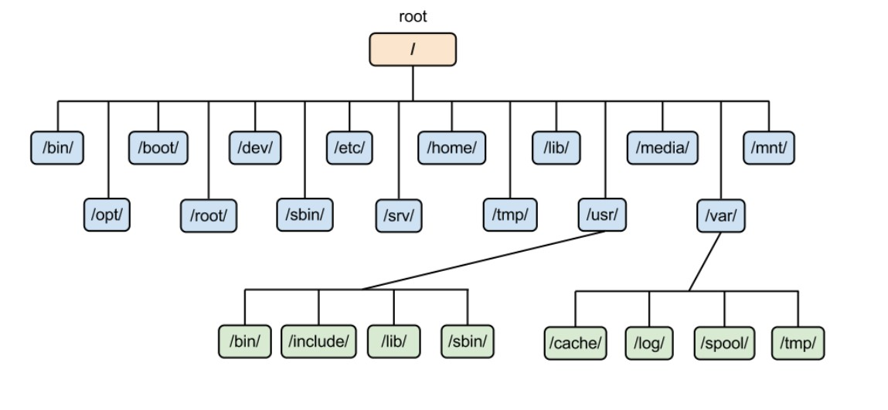

# Linux的基础知识

## Linux 目录

Linux系统下，一切皆是文件，不管是docx，pdf，ppt，mp3，mp4...，本质上它们都是文件。

Linux 文件系统包含排列在磁盘或其他区块存储设备的目录中的文件。

Microsoft® Windows®系统是在不同的驱动器盘符上（A:，C:等）使用不同的文件系统。 而 Linux 文件系统则截然不同，它是一个树形结构，以"/"目录作为根目录。




```
/    ## 根目录
bin  ## 系统程序
boot ## 内核和启动程序，所有和启动相关的文件都保存在这里
etc  ## 系统软件的启动和配置文件，系统在启动过程中需要读取的文件都在这个目录。如用户账户和密码。
dev  ## 设备文件
lib  ## 系统程序库文件 
tmp  ## 临时文件夹 
home ## 用户的主目录
```

根目录下面的目录是可以任意添加的，但是一般不建议随便添加，作为linux系统的普通用户，一般在自己的 `/home/youraccount` 下面操作。比如如果用户名是`biouser`的话，那你的用户家目录就是`/home/biouser`。
 
## 绝对路径与相对路径
绝对路径：路径的写法『一定由根目录  / 写起』，例如 `/usr/share/doc` 这个目录。 

相对路径：路径的写法『由当前所在目录写起』，例如由你当前所在的目录 `/usr/share/doc` 要到目标目录 `/usr/share/man` 底下时，可以写成： `cd ../man`。

```
## 在linux系统里特殊符号代表的意义
.   ## 代表此层目录
..  ## 代表上一层目录
-   ## 代表前一个工作目录
~   ## 代表『当前登陆用户』所在的家目录"/home/youraccount"，该用户对"/home/youraccount"目录拥有完全控制权
```


## 常用的目录操作命令

```
cd       ## 切换目录
pwd      ## 显示当前所在目录 
mkdir    ## 建立一个新的目录 
rmdir    ## 删除一个空的目录
```

范例：创建并删除目录

```
[biouser@your-computer-name ~]$ cd
##直接用cd不跟任何参数的时候，切换到用户的家目录
[biouser@your-computer-name ~]$ pwd
/home/biouser
## 先用pwd查看当前目录
[biouser@your-computer-name ~]$ mkdir newdir
## 创建一个叫newdir的目录
[biouser@your-computer-name ~]$ cd newdir/
## 用cd进入刚才创建的目录
[biouser@your-computer-name newdir]$ pwd
/home/biouser/newdir
## 用pwd查看当前目录
[biouser@your-computer-name newdir]$ cd ..
##　进入上层目录.. （.. 代表上一层目录）
[biouser@your-computer-name ~]$ rmdir newdir/
##　删除刚才创建的目录

```


## ls命令

```
ls 目录名称

选项与参数：
-a ：全部的目录，连同隐藏文件夹一起列出来
-h ：将目录容量转换为以易读的方式(例如  GB, KB 等等)
-l ：列出目录的详细信息
-S ：以文件大小排序
-t ：以时间排序

[biouser@your-computer-name ~]$ ls -alhS /usr/
total 136K
dr-xr-xr-x.   2 root root  36K Jun 25 22:03 bin
dr-xr-xr-x.  52 root root  36K Jun 19 01:17 lib64
dr-xr-xr-x.   2 root root  20K Jun 19 01:17 sbin
drwxr-xr-x.  13 root root 4.0K Feb 27 14:58 .
dr-xr-xr-x.  21 root root 4.0K Jul  1 23:30 ..
drwxr-xr-x.   2 root root 4.0K Apr 11  2018 etc
drwxr-xr-x.   2 root root 4.0K Apr 11  2018 games
drwxr-xr-x.  49 root root 4.0K Jun 17 10:52 include
dr-xr-xr-x.  41 root root 4.0K Jun 17 10:51 lib
drwxr-xr-x.  26 root root 4.0K Jun 19 01:17 libexec
drwxr-xr-x.  14 root root 4.0K Jun 17 22:48 local
drwxr-xr-x. 126 root root 4.0K Jun 25 22:03 share
drwxr-xr-x.   4 root root 4.0K Feb 27 14:58 src
lrwxrwxrwx.   1 root root   10 Feb 27 14:58 tmp -> ../var/tmp

## 以上命令列出在`/var`目录下面的所有子目录
```


## cp命令

```
cp 被拷贝的文件  目标目录
cp file1 file2 ... 目标目录

选项与参数：
-f ：强行复制文件或目录，   不论目的文件或目录是否已经存在
-i ：若目标文件(destination)已经存在时，在覆盖时会先询问用户
-p ：连同档案的属性一起复制过去，而非使用默认属性(备份常用)；
-u ：若destination 比  source 旧才更新  destination ！
-R ：复制目录及目录内的所有项目
-v ：显示执行过程

[biouser@main-lx ~]$ cp /etc/motd .
## 以上命令将`/etc/motd`这个文件拷贝到当前目录（`.`代表当前目录）

[biouser@your-computer-name:/data]$  cp -R /var/directory /data
## 以上命令将整个`/var/directory`目录拷贝到另外一个目录`/data`下面
```


## rm命令

```
rm 文件或目录

选项与参数：
-f ：忽略不存在的文件，不显示警告讯息
-i ：在删除会先询问用户
-r ：递归删除文件夹
```

范例一：删除test文件

```
[biouser@your-computer-name:/data]$  rm -i test 
rm: remove regular file `bashrc'? y
## 如果加上  -i 的选项，删除文件前，会要求用户再次确认，是否删除该文件，以免误删。
```

范例二：/tmp文件夹下以".sam"结尾的文件全部删除：

```
[biouser@your-computer-name:/tmp]$  rm *.sam
## *可以匹配任意字符，详细见下文通配符。
```

范例三：将/tmp/etc/目录删除

```
[biouser@your-computer-name:/tmp]$  rm -rf /tmp/etc 
```

## mv命令

```
mv 待移动的文件或目录   目标目录
mv file1 file2 ... 目标目录

选项与参数：
-f ：如果目标文件已经存在，不会询问而直接覆盖；
-i ：若目标文件已经存在时，询问用户是否覆盖
```

范例一：移动`text.txt`文件到`/tmp/etc`目录下

```
[biouser@your-computer-name:/tmp]$  mv text.txt /tmp/etc
```

范例二：将`text.txt`名称更名为`myfile`

```
[biouser@your-computer-name:/tmp]$  mv text.txt myfile
## 这是mv的另一个功能，为文件夹或文件重命名
```

范例三：移动目录`test1`，`test2`到 `/tmp/etc` 中

```
[biouser@your-computer-name:/tmp]$  mv test1 test2 /tmp/etc
```

## 解压缩命令

有些时候我们会需要处理一些压缩文件。根据文件的后缀名，需要以不同方式压缩的文件使用不同的命令进行解压：

- tar  `tar –xvf`
- .gz   `gzip -d` 或  `gunzip`
- .tar.gz 或 .tgz   `tar –xzf`
- .bz2   `bzip2 -d` 或  `bunzip2`
- .tar.bz2  `tar –xjf`
- .Z  `uncompress`
- .tar.Z  `tar –xZf`
- .rar  `unrar e`
- .zip   `unzip`


## 链接

> Linux链接分两种，一种被称为硬链接（Hard  Link），另一种被称为符号链接（Symbolic Link），也称为软连接。

> 默认情况下，ln命令产生硬链接。

### 【硬连接】

硬连接指通过索引节点来进行连接。在Linux的文件系统中，保存在磁盘分区中的文件都会得到一个分配的编号， 称之为索引节点号(Inode Index)。在Linux中，硬连接就是多个文件名指向同一索引节点，允许一个文件拥有多个有效路径名，这样用户就可以建立硬连接到重要文件，以防止“误删”的功能。如上所述，当目录的索引节点有一个以上的连接，只删除一个连接并不影响索引节点本身和其它的连接，只有当最后一个连接被删除后，文件的数据块 及目录的连接才会被释放。也就是说，文件真正删除的条件是与之相关的所有硬连接均被删除。

### 【软连接】

软链接类似于Windows的快捷方式。软连接实际上是一个文本文件，其指向另一文件的位置信息。

```
$ touch mf1 	# 创建一个测试文件mf1
$ ln mf1 mf2 	# 创建mf1的一个硬连接文件mf2
$ ln -s mf1 mf3 	# 创建mf1的一个符号连接文件mf3
$ ls -li 	# -i参数显示文件的inode节点信息
total 0
9797648 -rw-r--r-- 	2 oracle oinstall 0 Apr 21 08:11 mf1
9797648 -rw-r--r-- 	2 oracle oinstall 0 Apr 21 08:11 mf2
9797649 lrwxrwxrwx 	1 oracle oinstall 2 Apr 21 08:11 mf3 -> mf1
## 从上面的结果中可以看出，硬连接文件mf2与原文件mf1的inode节点相同，均为9797648，然而软连接文件的inode节点不同。


## TEST1
$ rm -f mf1
$ cat mf2
$ cat mf3
cat: mf3: No such file or directory
## 当删除原始文件mf1后，硬连接mf2不受影响，软连接mf1文件无效


## TEST2
$ rm -f mf2
$ cat mf1
$ cat mf3
## 当删除硬链接mf2后，原始文件mf1不受影响，软连接mf3文件不受影响


## TEST3
$ rm -f mf3
$ cat mf1
$ cat mf2
## 当删除软链接mf3后，原始文件mf1不受影响，硬连接mf2文件不受影响
 

## TEST3
$ rm -f mf1 mf2
## 当删除原始文件mf1，，硬连接mf2后，文件被彻底删除

```

注意：

1. 强烈不建议给目录创建硬链接，容易造成目录链接死循环
2. 不能跨硬盘分区创建硬链接


## 通配符

对一个文件对象执行命令操作是容易操作的。 但是，如果要对成千上百个文件执行相同的操作，手打命令是一个低效的形式。 要解决这个问题，可以使用 bash shell 中内置的通配符，通过通配符指定多个文件。 这种匹配按照如下方式完成：

| 字符 |	含义 |	实例	| 解释 |
| ------------- | -------------| -----| ----- |
| *	| 匹配 0 或多个字 符	| a\*b |	a与b之间可以有任意长度的任意字符，也可以一个 也没有，如ab, aab, acccccdb, a24322qqb。|
| ?	| 匹配任意单一字符	| a?b	| a与b之间必须有一个任意字符，如aqb, acb, a7b。|
|[list]	| 匹配list中的任意 单一字符	| a[xyz]b	| a与b之间必须是list列出的任意一个字符, 如: axb, ayb,  azb。|
| [!list]	| 匹配除list中的任 意单一字符	| a[!0-9]b |	a与b之间必须是除去阿拉伯字符的任意一个字符， 如axb, aab, a-b。|
|[c1-c2] |	匹配 c1-c2  中的 任意单一数字	| a[0-9]b	| a与b之间必须是0与9之间的一个字符，如a0b, a1b... a9b。|
|{string1...}	| 匹配 sring1或其 他字符串之一	| a{abc,xyz,123}b	| a与b之间只能是abc或xyz或123这三个字符串之 一。|


### 示例

```
## 1.拷贝文件
cp /tmp/file[0-9].txt /tmp/etc

## 2.删除'file'开头，'.txt'结尾的所有文件
rm -rf {file}*.txt
```

# linux 文本操作

## 查看文件命令

`cat` 命令将文件由前向后全部打印在屏幕上。

`tac` 命令将文件由后向前全部打印在屏幕上。

`head` 命令查看文件头部， -n 选项可以指定查看前几行。

`tail` 命令查看文件尾部， -n 选项可以指定查看后几行。

`more` 命令将以一页一页的形式展示内容，按空白键（space）向后一页。

`less` 命令用来查阅文档，功能更为强大。在使用`less`过程中，可以用以下的按键查看文件内容

```
q 	## 退出
g 	## 第一行
G 	## 最后一行
j 	## 下一行
k 	## 上一行
/ 	## 检索
n 	## 匹配到的前一个
N 	## 匹配到的后一个
```

`less` 还可以将文件整齐显示

```
less -SN text.txt
```

## 管道与重定向

在Linux里面，当多个命令协同工作的时候，Linux提供一种管道的方式来完成他们之间的通信。管道（|）可以将一个命令的输出作为另外一个命令的输入。

Linux很多命令都需要输入、输出以及错误信息，默认的输入输出以及错误信息都是标准输入（键盘）和标准输出（屏幕），但有时候我们希望输入、输出、错误信息是从其他地方输入、输出到其他（例如文件），这里就会涉及到输入、输出、错误信息的重定向。输入重定向符号： `<`。输出重定向符号： `>`(覆盖)， `>>` (追加)。

## echo命令

`echo`的功能是在显示器上显示一段文字，一般起到一个提示的作用。

```
echo -n 字符串

选项与参数：
-n 不要在最后自动换行
-e 显示转义字符
```

```
[biouser@your-computer-name ~]$ echo a
a
[biouser@your-computer-name ~]$ echo b
b
[biouser@your-computer-name ~]$ echo c
c
[biouser@your-computer-name ~]$ echo -e "a\nb\nc"
a
b
c
## 以上命令中，有`-e`参数的时候，"\n"是换行的意思

[biouser@your-computer-name ~]$ echo -e "a\nb\nc" > 1.txt
## 以上命令重定向将屏幕打印出来的东西写在 1.txt 文件里面
```


## cat命令

`cat` 命令将文件的内容打印在屏幕上，比如我们用`echo`命令创建一个新文件，然后把它打印出来：

```
[biouser@your-computer-name ~]$ echo -e "a\nb\nc" > 1.txt
[biouser@your-computer-name ~]$ cat 1.txt 
a
b
c
[biouser@your-computer-name ~]$ echo -e "d\ne\nf" > 2.txt
[biouser@your-computer-name ~]$ cat 2.txt 
d
e
f
```


## paste命令

用来将多个文件的内容合并，与下面  `cut` 命令完成的功能刚好相反。

首先确保两个文件行数相同。  `paste` 连接文件时，除非指定 `-d` 选项，否则默认用`空格`或`tab键`分隔文本。
 
```
$ paste 1.txt 2.txt
a 	d
b 	e
c 	f
```

## cut命令

`cut` 可以以列为单位处理数据

`-f` 选项指定列，可以是一个范围（比如2-8），注意不能用它给列排序。

上面提到的管道（|）可以将一个命令的输出作为另外一个命令的输入。在下面一个例子中，我们将前一个`grep`命令（下一节将详细讲述这个命令）的输出重定向到`head`命令，然后`head`命令的输出再重定向到`cut`命令。

```
$ grep -v "^#" Homo_sapiens.GRCh37.75.gtf | head -n 10 | cut -f 3-5 
gene 	11869 	14412
transcript 	11869 	14409 
exon 	11869 	12227
exon 	12613 	12721 
exon	13221 	14409 
transcript 	11872 	14412 
exon 	11872 	12227
exon 	12613 	12721 
exon	13225 	14412 
transcript 	11874 	14409

## 略过Homo_sapiens.GRCh37.75.gtf文件中以'#'开头的行，然后取出文件的前十行，再取出第3，4，5列
```

cut 默认以 `\t` 为分隔符， `-d` 选项可以指定分隔符，比如指定`,`为分隔符。


## grep命令


`grep`是一种强大的文本搜索工具，它能使用正则表达式搜索文本，并把匹配的行打印出来。`grep` 处理速度非常之快，尽量使用这个命令处理文本。

```
-v 	## 排除匹配到的
-w 	## 单词的完全匹配
-B 	## 指定输出匹配到的前多少行
-A 	## 指定输出匹配到的后多少行
-E 	## 指定支持扩展表达式
-C 	## 对匹配到的行计数
-o 	## 只输出匹配到的部分
```

```
$ grep -E -o 'gene_id "\w+"' Homo_sapiens.GRCh37.75.gtf | head -n 5 
gene_id "ENSG00000223972"
gene_id "ENSG00000223972" 
gene_id "ENSG00000223972" 
gene_id "ENSG00000223972"
gene_id "ENSG00000223972"
```

发现冗余项非常多，如果我们只要唯一值，怎么办呢？这个时候我们需要sort和uniq命令。

```
$ grep -E -o 'gene_id "(\w+)"' Homo_sapiens.GRCh37.75.gtf | cut -f2 -d" "| sort | uniq | head -n 5
"ENSG00000000003"
"ENSG00000000005"
"ENSG00000000419"
"ENSG00000000457"
"ENSG00000000460"
```

## sort命令

我们先创建一个bed格式文件来试试这个命令：

```
[biouser@your-computer-name:~]$ cat test.bed
chr1	26	39
chr3	32	47
chr1	40	50
chr1	9	28
chr2	35	54
chr1	10	19
biouser@your-computer-name:~$ sort test.bed
chr1	10	19
chr1	26	39
chr1	40	50
chr1	9	28
chr2	35	54
chr3	32	47
```

可以明显看到文本按照第一列进行了排序。

`sort` 默认用空格或tab键作为列分隔符。如果我们用其他形式的分隔符，需要用  `-t` 选项指定。

下面是对 `bed` 文件最通用的排序命令：

```
[biouser@your-computer-name:~]$ sort -k1,1 -k2,2n test.bed
chr1	9	28
chr1	10	19
chr1	26	39
chr1	40	50
chr2	35	54
chr3	32	47
```

`sort` 用 `-k` 选项指定某列的排序方式，要带上指定列的范围(start, end)。如果只指定一列，就为(start,start)了，
像上面命令的 `-k1,1` 就是。也许你会觉得 `-k2,2n` 很奇怪，这里的 `n` 指定程序把第二列当做数值对待。如果不做 设定，都是当做字符对待（shell都是这么对待数值数据的）。所以总结其他这一行命令就是对第一列按照字符排 序，第二列按照数值排序。

我们可以用 `-c` 选项检查一个文件是不是已经按照过某种方式排过序了。

```
[biouser@your-computer-name:~]$ sort -k1,1 -k2,2n test.bed | sort -k1,1 -k2,2 -c 
sort：-:2：无序：   chr1 	10 	19
[biouser@your-computer-name:~]$ echo $?
1
[biouser@your-computer-name:~]$ sort -k1,1 -k2,2n test.bed | sort -k1,1 -k2,2n -c 
[biouser@your-computer-name:~]$ echo $?
0
```

上面可以清楚地看到 `sort` 是怎么对待文件的（一般shell返回0表示成功执行）。

```
[biouser@your-computer-name:~]$ tsfds 
tsfds：未找到命令
[biouser@your-computer-name:~]$ echo $?
127
[biouser@your-computer-name:~]$ echo test 
test
]biouser@your-computer-name:~]$ echo $?
0
```

shell的命令退出状态码表示了该命令执行的完成的某种情况。不同的状态码有不同的含义。0代表成功执行。

反向排序用 `-r` 选项。如果你只想反转一列，可以把它加在 `-k` 选项后。

```
[biouser@your-computer-name:~]$ sort -k1,1 -k2,2nr test.bed
chr1	40	50
chr1	26	39
chr1	10	19
chr1	9	28
chr2	35	54
chr3	32	47
```

现在我给 `test.bed` 加一行：

```
[biouser@your-computer-name:~]$ cat test.bed
chr1	26	39
chr3	32	47
chr1	40	50
chr1	9	28
chr2	35	54
chr1	10	19
chr11	22	56
```

你会发现有点奇怪

```
[biouser@your-computer-name:~]$ sort -k1,1 -k2,2n test.bed
chr1	9	28
chr1	10	19
chr1	26	39
chr1	40	50
chr11	22	56
chr2	35	54
chr3	32	47
```

怎么 `chr11` 在 `chr2` 前面？其实 `sort` 排序的方式有点像查字典。例子中，命令先比较 `c` ，然后比较 `h` ，然后比较 `r` ，接着比较 `1` ，自然 `11` 会在 `2` 前面了。这里可以添加  `V` 选项修改。
 
```
$ sort -k1,1V -k2,2n test.bed
chr1	9	28
chr1	10	19
chr1	26	39
chr1	40	50
chr2	35	54
chr3	32	47
chr11	22	56
```


## uniq命令

首先创建样例文本

```
$ cat test.letter
A 
A 
B 
C 
B 
C 
C
```

使用 uniq 看看

```
$ uniq test.letter
A 
B 
C 
B 
C
```

怎么不对。它好像只去掉了连续的同一字符。

```
$ sort test.letter | uniq
A 
B 
C 
D 
F
```

加 `-c` 选项计数：
 
```
$ sort test.letter | uniq -c
2 A
2 B
4 C
2 D
1 F
```

再把结果排序

```
[biouser@your-computer-name:~]$ sort test.letter | uniq -c | sort -rn
4 C
2 D
2 B
2 A
1 F
```

`-d` 选项只输出重复行

```
$ uniq -d test.letter
A 
C
$ sort test.letter | uniq -d
A 
B 
C 
D
```

# 更多的帮助

##  查询用户手册

要查看任何命令的手册页，可以使用`man`命令。例如，

```
man rm
```

显示`rm`的用途，如何使用它，可用的选项，使用示例以及更多有用的信息。

# 致谢

本文档由郭徨纯提供，加以少许改动。
