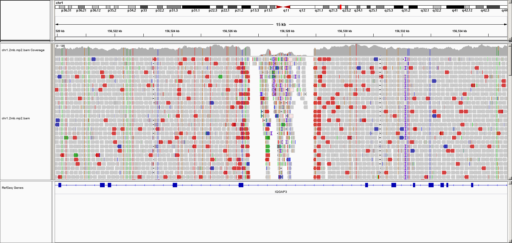
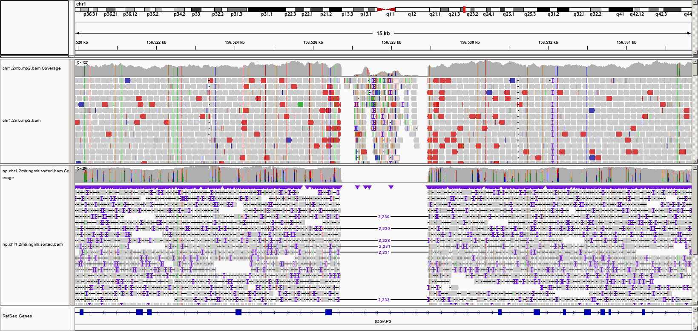

## Detection of copy number variants from DNA microarrays

1. Create a folder for this project, using the `mkdir -p ~/project/penncnv/` command.

2. Our initial exercise will focus on examples included in the PennCNV package. 

Do `cd ~/project/penncnv` to enter the directory.

We will set up a symbolic link to make the commands below easier to write:

```
ln -s /shared/tools/PennCNV/example/example.hmm
ln -s /shared/tools/PennCNV/example/example.pfb 
ln -s /shared/tools/PennCNV/example/father.txt 
ln -s /shared/tools/PennCNV/example/mother.txt 
ln -s /shared/tools/PennCNV/example/offspring.txt 
```

Essentially, this command creates a few symbolic links to the files /shared/tools/PennCNV/example directory in the current directory. You can type a `ls -l` to see details.

3. We will first perform CNV calling on three signal intensity files to see how the procedure works:

```
detect_cnv.pl -test -hmm example.hmm -pfb example.pfb -conf -log ex1.log -out ex1.rawcnv father.txt mother.txt offspring.txt
```

This command generates CNV calls for three samples (stored in the father.txt, mother.txt and offpsring.txt files).

We can take a look of the output file to see what it contains:

```
cat ex1.rawcnv
```

As you can see, the file contains 4 CNV calls in father.txt, 2 CNV calls in mother.txt and 4 CNV calls in offspring.txt.

4. We next want to filter the CNV calls and only keep more confident calls (that contain more than 10 markers and are longer than 50kb)

```
filter_cnv.pl -numsnp 10 -length 50k -type del ex1.rawcnv > ex1.filtercnv
```

Now, take a look at the new file:

```
cat ex1.filtercnv
```

As you can see, the file contains 1 CNV call in father.txt, 1 CNV call in mother.txt and 2 CNV calls in offspring.txt. One of the CNV call is listed below:

```
chr3:3957986-4054960          numsnp=50     length=96,975      state2,cn=1 offspring.txt startsnp=rs11716390 endsnp=rs17039742 conf=219.721
```

This is a very large CNV call that is observed in offspring but not in parents. It is potentially a de novo CNV, but we want to double check this.


5. Next, we are going to infer SNP alleles and determine the de novo status of CNV calls

```
infer_snp_allele.pl -pfb example.pfb -hmm example.hmm -denovocn 1 -start rs11716390 -end rs17039742 -out ex14.geno father.txt mother.txt offspring.txt
```

This command generates a new geno file that contains the genotype calls between two SNPs, and assess whether a CNV call is likely to be a de novo CNV.

6. Finally, we will generate some plots to visually inspect the CNV calls

```
visualize_cnv.pl -format plot -signal offspring.txt ex1.filtercnv
```

You will see messages like below:

```
NOTICE: Signal values for 2 CNV regions are found in offspring.txt
NOTICE: Processing sample offspring.txt CNV chr20:10511631-10583260 with copy number of 1 ...  written to offspring.txt.chr20.10511631.JPG
NOTICE: Processing sample offspring.txt CNV chr3:3957986-4054960 with copy number of 1 ...  written to offspring.txt.chr3.3957986.JPG
```

Then run a `ls` command, and you will see two new JPG files in the directory. Try to use SFTP to transfer the two JPG files to your local computer, and examine these two image files.


## Detection of structural variants (SVs) from short-read sequencing data

We can use Delly (https://github.com/dellytools/delly) to call SVs from short-read sequencing data


1. Create a folder for this project, using the `mkdir -p ~/project/short_reads_sv/` command. Use `cd ~/project/short_reads_sv/` to enter the directory.

Run the following command to activate conda environment : 

```
. "/shared/miniconda3/etc/profile.d/conda.sh"
conda activate base
```


2. We will use the bam files generated in the alignment training section as input. You should alreadly have the following files if you have completed the alignment section (note that the `~` sign means the user's home directory, for example, the `~` for `biouser` means `/home/biouser`.

```
~/project/alignment/short-reads/chr1.2mb.bwa.bam # aligner: BWA-MEM
~/project/alignment/short-reads/chr1.2mb.mp2.bam # aligner: Minimap2
```

If you have not finish the alignment section, you can find the bam files here: 

```
/shared/data/NA12878_test_data/short-reads/aligned_bam_for_sv_calling/chr1.2mb.bwa.bam
/shared/data/NA12878_test_data/short-reads/aligned_bam_for_sv_calling/chr1.2mb.mp2.bam
```

You can use the following commands to run Delly: 


```
delly call -g /shared/data/ref_hg37_chr1/ref/hg37d5.chr1.fa -o chr1.2mb.bwa.bam.delly.bcf ~/project/alignment/short-reads/chr1.2mb.bwa.bam
delly call -g /shared/data/ref_hg37_chr1/ref/hg37d5.chr1.fa -o chr1.2mb.mp2.bam.delly.bcf ~/project/alignment/short-reads/chr1.2mb.mp2.bam
```

In the above commands, `-g` specifies the reference fasta file and `-o` specifies the output BCF file. BCF is the binary version of VCF.

The tool will print out some information to the screen, you will see "Sample statistics" similar to below:

```
Sample:chr1.2mb.bwa,ReadSize=148,Median=551,MAD=101,UniqueDiscordantPairs=1503
```

3. The program will run for a few minutes and we can get the following output files. 

```
chr1.2mb.bwa.bam.delly.bcf
chr1.2mb.bwa.bam.delly.bcf.csi
chr1.2mb.mp2.bam.delly.bcf
chr1.2mb.mp2.bam.delly.bcf.csi
```
The `.csi` file is the index file of the `.bcf` files. 

We can use bcftools to convert the `.bcf` files to VCF format: 

```
bcftools view chr1.2mb.bwa.bam.delly.bcf > chr1.2mb.bwa.bam.delly.vcf
bcftools view chr1.2mb.mp2.bam.delly.bcf > chr1.2mb.mp2.bam.delly.vcf
```

4. There is a know SV within this 2Mb region at 1:156526706-156528935 (deletion). This SV is documented in the GIAB SV call set [here](http://ftp-trace.ncbi.nlm.nih.gov/giab/ftp/technical/svclassify_Manuscript/Supplementary_Information/Personalis_1000_Genomes_deduplicated_deletions.bed) or here: `/shared/data/NA12878_test_data/short-reads/aligned_bam_for_sv_calling/NA12878_Personalis_1000_Genomes_deduplicated_deletions.bed`.  This is a 3-column BED file, and if you search through the BED file you can see a record "1	156526705	156528935" there. Since BED file uses zero-start coordiante, this translate to 1:156526706-156528935 in 1-start coordinate. 


We can use the following command to check if we have detected any SVs that overlap with the GIAB SV call set. 

```
bedtools intersect  -a chr1.2mb.bwa.bam.delly.vcf -b /shared/data/NA12878_test_data/short-reads/aligned_bam_for_sv_calling/NA12878_Personalis_1000_Genomes_deduplicated_deletions.bed  -f 0.5 -F 0.5  -wb 
```

The `intersect` command in bedtools finds the intersection of two files (-a and -b) . `-f 0.5` specifies that the minimum overlap required as a fraction of the SV in file a is 0.5 and `-F 0.5` specifies that the minimum overlap required as a fraction of the SV in file b is 0.5. 50% reciprocal overlapping is the recomanded requirement for finding overlapping SV calls from two data sets. By default, only the SV in file a is output. `-wb` specifies that the record in file b should be output as well. 

This command will generate the following results: 

`1	156526724	DEL00000036	C	<DEL>	.	PASS	IMPRECISE;SVTYPE=DEL;SVMETHOD=EMBL.DELLYv0.8.1;CHR2=1;END=156528936;PE=101;MAPQ=60;CT=3to5;CIPOS=-51,51;CIEND=-51,51	GT:GL:GQ:FT:RCL:RC:RCR:CN:DR:DV:RR:RV	1/1:-606.474,-30.5794,0:10000:PASS:356:137:279:0:0:102:0:0	1	156526705   156528935`

We can see that one overlapping call is found. 
The last 3 columns represent the SV call in the GIAB SV call set. The first 11 columns are from the `chr1.2mb.bwa.bam.delly.vcf` file. `1	156526724` indicates that the first breakpoint is at chr1:156526724; `CHR2=1;END=156528936` indicates that the second breakpoint is at chr1:156528936. 

We can use the a similar command to find the overlapping calls between `chr1.2mb.mp2.bam.delly.vcf` and the GIAB truth set. 

```
bedtools intersect  -a chr1.2mb.mp2.bam.delly.vcf -b /shared/data/NA12878_test_data/short-reads/aligned_bam_for_sv_calling/NA12878_Personalis_1000_Genomes_deduplicated_deletions.bed  -f 0.5 -F 0.5  -wb 
```

This command will generate the following results: 

`1	156526724	DEL00000099	C	<DEL>	.	PASS	IMPRECISE;SVTYPE=DEL;SVMETHOD=EMBL.DELLYv0.8.1;CHR2=1;END=156528936;PE=94;MAPQ=60;CT=3to5;CIPOS=-50,50;CIEND=-50,50	GT:GL:GQ:FT:RCL:RC:RCR:CN:DR:DV:RR:RV	1/1:-557.599,-28.2956,0:10000:PASS:356:80:274:0:0:94:0:0	1	156526705   156528935`

You can see that, Delly generated the same SV call from `chr1.2mb.bwa.bam` and `chr1.2mb.mp2.bam`. 


You can use the following command to find overlapping calls from `chr1.2mb.bwa.bam` and `chr1.2mb.mp2.bam`.

```
bedtools intersect -a chr1.2mb.bwa.bam.delly.vcf -b chr1.2mb.mp2.bam.delly.vcf -f 0.8 -F 0.8 -wb > chr1.bwa_mp2_overlapping_svs.txt
```


However, in addition to this particular deletion, Delly generated many more SV calls on both BAM files. We can do some more investigation here. Using `bcftools`, we can see that there are 43 SV records in the first file and 117 records in the second file. Many such records have a FILTER called LowQual. To check this we can use the command below:

```
bcftools query -e'FILTER="."' -f'%CHROM %POS %FILTER\n' chr1.2mb.bwa.bam.delly.bcf
```

We can see that there are only 7 SV calls that have PASS as the filter. Next, we want to generate a new SV call set with filtered calls (with higher confidence).

```
bcftools filter -e 'FILTER="LowQual"' chr1.2mb.bwa.bam.delly.bcf -Ob -o chr1.2mb.bwa.bam.delly.filter.bcf
bcftools filter -e 'FILTER="LowQual"' chr1.2mb.mp2.bam.delly.bcf -Ob -o chr1.2mb.mp2.bam.delly.filter.bcf

bcftools index chr1.2mb.bwa.bam.delly.filter.bcf
bcftools index chr1.2mb.mp2.bam.delly.filter.bcf

bcftools view chr1.2mb.bwa.bam.delly.filter.bcf > chr1.2mb.bwa.bam.delly.filter.vcf
bcftools view chr1.2mb.mp2.bam.delly.filter.bcf > chr1.2mb.mp2.bam.delly.filter.vcf

```

The resulting VCF files have 7 and 6 records, respectively. You can use `bcftools stats` to check that. Among them, 2 records are identical/similar between the two files by manual review.

You can use the following command to find overlapping calls: 

```
bedtools intersect -a chr1.2mb.bwa.bam.delly.filter.vcf -b chr1.2mb.mp2.bam.delly.filter.vcf -u
```
This will output the SV calls in file a (`chr1.2mb.bwa.bam.delly.filter.vcf`) that have overlapping with SVs in file b(`chr1.2mb.mp2.bam.delly.filter.vcf`). 

Here `-u` means that if one SV call in file a has multiple overlapping calls in file b, only output the SV call once. 


Another important thing to note is that several of these variants have genotype of "0/0" which means that even though a potentail SV is detected, it is not genotyped. Based on [this article](https://groups.google.com/forum/#!topic/delly-users/i9srCzuhNhc), Delly tries to maximize sensitivity during SV discovery. The genotyping, however, is very conservative and involves a re-alignment of reads against the reference and the alternative haplotype so it can indeed happen that an SV is discovered but then genotyping settles on 0/0 (homozygous reference). In our results, the shared SVs (1:155119793-155119899 inversion, 156526724-156528936 deletion) have identical genotypes between the two files.

If your local computer has IGV (Integrative Genomics Viewer) installed, you can actually visualize the alignment files to manually check the region with predicted SV calls. An example of the deletion is shown below:




## Detection of structural variants (SVs) from long-read sequencing data


We can use NGMLR (https://github.com/philres/ngmlr) to align the long reads to the reference genome and use Sniffles (https://github.com/fritzsedlazeck/Sniffles) to call SVs from the bam file. 


1. Run the following command to activate conda environment : 

```
. "/shared/miniconda3/etc/profile.d/conda.sh"
conda activate base
```

2. Create a folder for this project, using the `mkdir -p ~/project/long_read_sv/` command. Use `cd ~/project/long_read_sv/` to enter the directory.

3. We can use the following commands to align the long reads to the reference genome:

```
ngmlr -x ont -r /shared/data/ref_hg37_chr1/ref/hg37d5.chr1.fa -q /shared/data/NA12878_test_data/long-reads/np.chr1.2mb.fq -o np.chr1.2mb.ngmlr.sam

# sort the alignments
samtools sort -o np.chr1.2mb.ngmlr.sorted.bam np.chr1.2mb.ngmlr.sam 

# create an index file for the bam 
samtools index np.chr1.2mb.ngmlr.sorted.bam

# rm the unsorted SAM file because we have the sorted bam file

rm np.chr1.2mb.ngmlr.sam 
```


For ngmlr, the default settings is for PacBio reads. In the first line of the above commands, `-x ont` specify that the input reads are Oxford Nanopore reads. 

4. You can use the following commands to run Sniffles: 

```
sniffles -m np.chr1.2mb.ngmlr.sorted.bam -v np.chr1.2mb.ngmlr.sorted.bam.vcf
```

In the above commands, `-m` specifies the sorted bam file and `-v` specifies the output VCF file. 

Tip: If you failed to generate the sorted bam file in step 3, you can use the bam file here for SV calling:  

```
/shared/data/NA12878_test_data/long-reads/bam_for_sv_calling/np.chr1.2mb.ngmlr.sorted.bam
```


4. Simialr to the short-read section, we can use the following command to check if there is any overlapping call with the GIAB SV call set.

```
bedtools intersect -a np.chr1.2mb.ngmlr.sorted.bam.vcf  -b /shared/data/NA12878_test_data/short-reads/aligned_bam_for_sv_calling/NA12878_Personalis_1000_Genomes_deduplicated_deletions.bed  -f 0.5 -F 0.5 -wb 
```

This command will generate the following output: 

`1	156526705	22	GAAATTGAGTAGCTCAGCCTCTGCCCCGCCGCCCTGTCTGGGATGTGAGGAGCACCTCTGCTGGGCCGCAACCCTGTCTGGGATGTGAGGAGTGCCTCTGCCCGGCCGCCCCGTCTGAGAAGTGAGGAAACCCTCTGCCTGGCAACCGCCCCGTCTGAGAAGTGAGGAGCCCCTCCGTCCGGCAGCCACCCCGTCTGGGAAGTGAGGAGCGTCTCCGCCCGGCAGCCACCCCGTCCGGGAGGGAGGTGGCGGGGGGGTCAGCCCCACGCCCGGCCAGCCGCCCCGTCCGGGAGGTGAGGGGCTCCTCTGCCCGGCCGCCCCTACTGGGAAGTGAGGAGCCCCTCTGCCCGGCCAGCCGCCCCGTCCGGGAGGGAGGTGGGGGGTCAGCCCCCCGCCCGGCCAGCCGCCCAGTCCGGGAGGGAGGTGGGGGGTCAGCCCCCCACCCGGCCAGCCGCCCCGTCCGGGAGGGAGGTGGGGGGGTCAGCCCCCCGCCCGGCCAGCCGCCCCGTCCGGGAGGGAGGTGGGGGGGGTCAGCCCCCCGCCTGGCCAGCCACCCCGTCCGGGAGGTGAGGGGCGCCTCTGCCCGGCTGCCCCTACTGGGAAGTGAGGACCCCTCTGCCCGGCCAGCCGCCCCGTCCGGGAGGGAGGTGGGGGGGTCAGCCCCCCGCCCGGCCAGCCGCCCCATCCGGGAGGGAGGTGGGGGGGTCAGCCCCCCGCCCGGCCAGCCGCCCCGTCCGGGAGGGAGGTGGGGGGGGTCAGCCCCCCGCCCGGCCAGCCGCCCTGTCCGGGAGGGAGGCGCGGGGGGGGGTCGGCCAGCCGCCCCGTCCGGGAGGGAGGTGGGGGGGTCAGCCCCCCGCCCGGCCAGCCGCCCAGTCCGGGAGGGAGGTGGGGGGATCAGCCCCCCGCCTGGCCAGCCACCCCGTCCGGGAGGTGAGGGGCGCCTCTGCCCGGCCGCCCCTACTGGGAAGTGAGGAGCCCCTCTGCCCGGCCAGCCGCCCCGTCCGGGAGGGAGGTGGGGGGGTCAGCCCCCCGCCCAGCCAGCCGCCCCATCCGGGAGGGAGGTGGGGGGGTCAGCCCCCCGCCCGGCCAGCCGCCCCGTCCGGGAGGGAGGTGGGGGGGGTCAGCCCCCCGCCCGGCCAGCCGCCCCGTCCGGGAGGGAGGTGGGGGGATCAGCCCCCCGCCTGGCCAGCCACCCCGTCCGGGAGGTGAGGGGCGCCTCTGCCCGGCCGCCCCTACTGGGAAGTGAGGAGCCCCTCTGCCCGGCCAGCCGCCCCGTCCGGGAGGGAGGCGCGGGGGGGGGGCCGGCCAGCCGCCCTGTCCGGGAGGGAGGTGGGGGGGTCAGCCCCCCGCCCGGCCGGCCGCCCCGTCCGGGAGGTGAGGGGCGCCTCTGCCCGGCCGCCCCTACTGGGAAGTGAGGAGCCCCTCTGCCTGGCGAGCCGCCCCGTCCGGGAGGGTGGTGGGGGGGTCAGCCCCCCGCCCGGCCAGCCGCCCTATCCAGGAGGTGAGGGGCGCCTCTGCCCGGCCGCCCCTACTGGGAAGTGAGGAGCCCCTCTGCCTGGCCAGCCGCCCCGTCCGGGAGGGTGGTGGGGGGGTCAGCCCCCCGCCCGGCCAGCCGCCCCACCCGGGAGGTGAGGGGCGCTTCTGCCCGGCCGCCCCTACTGGGAAGTGAGGAGCCCCTCTGCCCGGCCACGACCCCGTCTGGGAGGTGTGCCCAGCGGCTCATTGGGGATGGGCCATGATGACAATGGCGGTTTTGTGGAATAGAAAGGCGGGAAGGGTGGGGAAAAAATTGAGAAATCAGATGGTTGCCGGGTCTGTGTGGATAGAAGTAGACATGGGAGACTTTTCATTTTGTTCTGTACTAAGAAAAATTCTTCTGCCTTGGGATCCTGTTGATCTGTGACCTTATCCCCAACCCTGTGCTCTCTGAAACATGTGCTGTGTCCACTCAGGGTTAAATGGATTAAGGGCGGTGCAAGATGTGCTTTGTTAAACAGATGCTTGAAGGCAGCATGCTCGTTAAGAGTCATCACCACTCCCTAATCTTAAGTACCCAGGGACACAAACACTGCGGAAGGCCGCAGGGTCCTCTGCCTAGGAAAACCAGAGACCTTTGTTCACTTGTTTATCTGCTGACCTTCCCTCCACTATTGTCCTATGACCCTGCCAAATCCCCCTCTGCGAGAAACACCCAAGAATGATCAATAAAAAAAAAAAAAAAAAAAAAAAAAGA	N	.	PASS	PRECISE;SVMETHOD=Snifflesv1.0.11;CHR2=1;END=156528935;STD_quant_start=4.010403;STD_quant_stop=4.839077;Kurtosis_quant_start=8.887969;Kurtosis_quant_stop=-1.193922;SVTYPE=DEL;SUPTYPE=AL,SR;SVLEN=-2230;STRANDS=+-;RE=25 GT:DR:DV	./.:.:25	1	156526705	156528935`


We can see that one overlapping call is found. 
The last 3 columns represent the SV call in the GIAB SV call set. The first 11 columns are from the `np.chr1.2mb.ngmlr.sorted.bam.vcf` file. `1	156526705` indicates that the first breakpoint is at chr1:156526705; `CHR2=1;END=156528935` indicates that the second breakpoint is at chr1:156528935. You can see that the SV call detected from the long reads is exactly the same as the call in the GIAB call set. 

`SVTYPE=DEL` means the sv type is deletion. `SVLEN=-2230` means the sv length is 2230 bp and the minus sign means it's a deletion. RE=25 means that there are 25 reads supporting this SV. 


5. You can also run Sniffles on the minimap2 aligned bam file. If you have finished the alignment section, you can find the bam file here:

```
/home/biouser/project/alignment/long-reads/chr1.2mb.bam
```

If not, you can use the bam file here: 

```
/shared/data/NA12878_test_data/long-reads/bam_for_sv_calling/chr1.2mb.bam
```

The command is:

```
# creating a symbolic link
ln -s /home/biouser/project/alignment/long-reads/chr1.2mb.bam chr1.2mb.minimap2.sorted.bam 
ln -s /home/biouser/project/alignment/long-reads/chr1.2mb.bam.bai chr1.2mb.minimap2.sorted.bam.bai


# run sniffles
sniffles -m chr1.2mb.minimap2.sorted.bam -v chr1.2mb.minimap2.sorted.bam.vcf
```

6. We can use the following command to check if there is any overlapping call with the GIAB SV call set.

```
bedtools intersect -a chr1.2mb.minimap2.sorted.bam.vcf  -b /shared/data/NA12878_test_data/short-reads/aligned_bam_for_sv_calling/NA12878_Personalis_1000_Genomes_deduplicated_deletions.bed  -f 0.5 -F 0.5 -wb 
```

This will generate the following output:

`1	156526723	30	AGAAATTGAGTAGCTCAGCCTCTGCCCCGCCGCCCTGTCTGGGATGTGAGGAGCACCTCTGCTGGGCCGCAACCCTGTCTGGGATGTGAGGAGTGCCTCTGCCCGGCCGCCCCGTCTGAGAAGTGAGGAAACCCTCTGCCTGGCAACCGCCCCGTCTGAGAAGTGAGGAGCCCCTCCGTCCGGCAGCCACCCCGTCTGGGAAGTGAGGAGCGTCTCCGCCCGGCAGCCACCCCGTCCGGGAGGGAGGTGGCGGGGGGGTCAGCCCCACGCCCGGCCAGCCGCCCCGTCCGGGAGGTGAGGGGCTCCTCTGCCCGGCCGCCCCTACTGGGAAGTGAGGAGCCCCTCTGCCCGGCCAGCCGCCCCGTCCGGGAGGGAGGTGGGGGGTCAGCCCCCCGCCCGGCCAGCCGCCCAGTCCGGGAGGGAGGTGGGGGGTCAGCCCCCCACCCGGCCAGCCGCCCCGTCCGGGAGGGAGGTGGGGGGGTCAGCCCCCCGCCCGGCCAGCCGCCCCGTCCGGGAGGGAGGTGGGGGGGGTCAGCCCCCCGCCTGGCCAGCCACCCCGTCCGGGAGGTGAGGGGCGCCTCTGCCCGGCTGCCCCTACTGGGAAGTGAGGACCCCTCTGCCCGGCCAGCCGCCCCGTCCGGGAGGGAGGTGGGGGGGTCAGCCCCCCGCCCGGCCAGCCGCCCCATCCGGGAGGGAGGTGGGGGGGTCAGCCCCCCGCCCGGCCAGCCGCCCCGTCCGGGAGGGAGGTGGGGGGGGTCAGCCCCCCGCCCGGCCAGCCGCCCTGTCCGGGAGGGAGGCGCGGGGGGGGGTCGGCCAGCCGCCCCGTCCGGGAGGGAGGTGGGGGGGTCAGCCCCCCGCCCGGCCAGCCGCCCAGTCCGGGAGGGAGGTGGGGGGATCAGCCCCCCGCCTGGCCAGCCACCCCGTCCGGGAGGTGAGGGGCGCCTCTGCCCGGCCGCCCCTACTGGGAAGTGAGGAGCCCCTCTGCCCGGCCAGCCGCCCCGTCCGGGAGGGAGGTGGGGGGGTCAGCCCCCCGCCCAGCCAGCCGCCCCATCCGGGAGGGAGGTGGGGGGGTCAGCCCCCCGCCCGGCCAGCCGCCCCGTCCGGGAGGGAGGTGGGGGGGGTCAGCCCCCCGCCCGGCCAGCCGCCCCGTCCGGGAGGGAGGTGGGGGGATCAGCCCCCCGCCTGGCCAGCCACCCCGTCCGGGAGGTGAGGGGCGCCTCTGCCCGGCCGCCCCTACTGGGAAGTGAGGAGCCCCTCTGCCCGGCCAGCCGCCCCGTCCGGGAGGGAGGCGCGGGGGGGGGGCCGGCCAGCCGCCCTGTCCGGGAGGGAGGTGGGGGGGTCAGCCCCCCGCCCGGCCGGCCGCCCCGTCCGGGAGGTGAGGGGCGCCTCTGCCCGGCCGCCCCTACTGGGAAGTGAGGAGCCCCTCTGCCTGGCGAGCCGCCCCGTCCGGGAGGGTGGTGGGGGGGTCAGCCCCCCGCCCGGCCAGCCGCCCTATCCAGGAGGTGAGGGGCGCCTCTGCCCGGCCGCCCCTACTGGGAAGTGAGGAGCCCCTCTGCCTGGCCAGCCGCCCCGTCCGGGAGGGTGGTGGGGGGGTCAGCCCCCCGCCCGGCCAGCCGCCCCACCCGGGAGGTGAGGGGCGCTTCTGCCCGGCCGCCCCTACTGGGAAGTGAGGAGCCCCTCTGCCCGGCCACGACCCCGTCTGGGAGGTGTGCCCAGCGGCTCATTGGGGATGGGCCATGATGACAATGGCGGTTTTGTGGAATAGAAAGGCGGGAAGGGTGGGGAAAAAATTGAGAAATCAGATGGTTGCCGGGTCTGTGTGGATAGAAGTAGACATGGGAGACTTTTCATTTTGTTCTGTACTAAGAAAAATTCTTCTGCCTTGGGATCCTGTTGATCTGTGACCTTATCCCCAACCCTGTGCTCTCTGAAACATGTGCTGTGTCCACTCAGGGTTAAATGGATTAAGGGCGGTGCAAGATGTGCTTTGTTAAACAGATGCTTGAAGGCAGCATGCTCGTTAAGAGTCATCACCACTCCCTAATCTTAAGTACCCAGGGACACAAACACTGCGGAAGGCCGCAGGGTCCTCTGCCTAGGAAAACCAGAGACCTTTGTTCACTTGTTTATCTGCTGACCTTCCCTCCACTATTGTCCTATGACCCTGCCAAATCCCCCTCTGCGAGAAACACCCAAGAATGATCAATAAAAAAAAAAAAAAAAAAAAAAAAAG	N	.	PASS	PRECISE;SVMETHOD=Snifflesv1.0.11;CHR2=1;END=156528935;STD_quant_start=0.645497;STD_quant_stop=1.040833;Kurtosis_quant_start=-0.613781;Kurtosis_quant_stop=-1.373926;SVTYPE=DEL;SUPTYPE=AL,SR;SVLEN=-2212;STRANDS=+-;RE=25	GT:DR:DV	./.:.:25	1	156526705	156528935`


If your local computer has IGV (Integrative Genomics Viewer) installed, you can actually visualize the alignment files to manually check the region with predicted SV calls. As a comparison, we also loaded the short-read BAM files. An example of the deletion is shown below:


