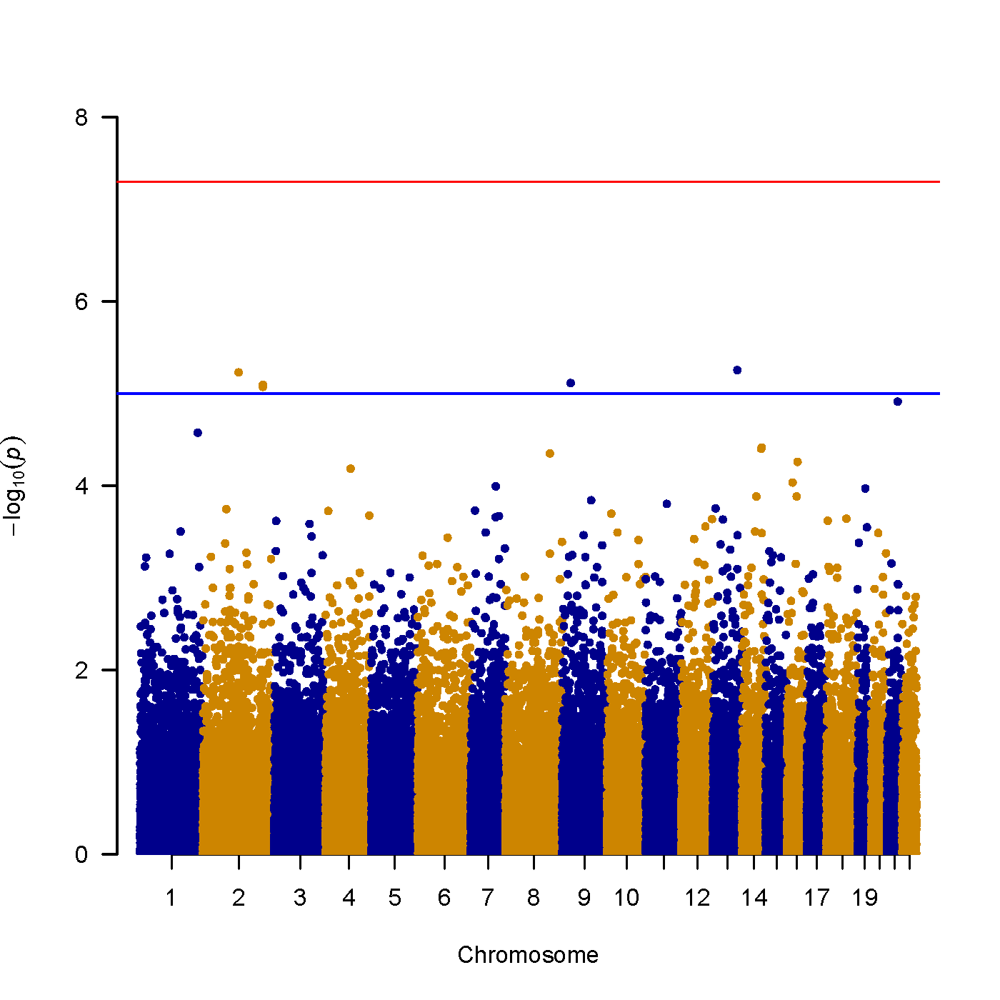
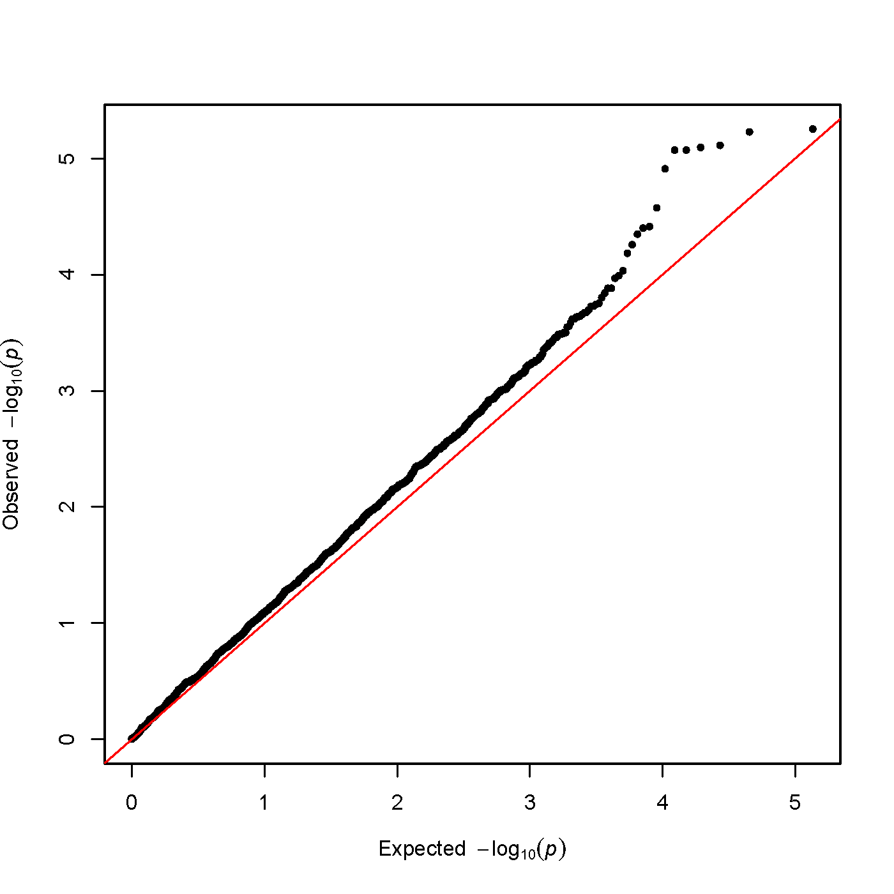

This is a tutorial for how to use PLINK for data analysis. This is the most widely used tool for genome-wide association studies with many different functionalities and options. Please note that the data used here is simulation data provided by the software developers, and this exercise is a simplified version of the tutorial provided by the developers.

## Preparation of folders and data for analysis

```
mkdir ~/project/plink/
cd ~/project/plink/
ln -s /shared/data/PLINK_data/* .
```
The commands above will create a directory for data analysis, and also link the data. 

### Discription of data
This data is simulated phenotype on the genotype with 1 SNP (on chromosome 2, rs2222162) together with randomly selected genotypes of ~80K autosomal SNPs from 45 Chinese and 44 Japanese HapMap individuals. There are two phenotypes: a quantitative trait and a disease trait, and 1=unaffected and 2=affected. The distribution of disease and subpopulation/genotypes are given below:

|          |Chinese   |Japanese |
|---|---|---|
|Control   |   34     |   11    |
|Case      |   11     |   33    |

|             |11      |12      |22|
|---|---|---|---|
|Control      |17      |22      |6 |
|Case         |3       |19      |22|

That is, one of thousands SNPs is associated with disease, but complicated by subpopulation-disease association. 

The hapmap1.ped and hapmap1.map files are text files. You can use `less` command to examine these files. 

## Check the files and get basic statistics
```
plink --noweb --file hapmap1
```
will show
```
@----------------------------------------------------------@
|        PLINK!       |     v1.07      |   10/Aug/2009     |
|----------------------------------------------------------|
|  (C) 2009 Shaun Purcell, GNU General Public License, v2  |
|----------------------------------------------------------|
|  For documentation, citation & bug-report instructions:  |
|        http://pngu.mgh.harvard.edu/purcell/plink/        |
@----------------------------------------------------------@

Skipping web check... [ --noweb ]
Writing this text to log file [ plink.log ]
Analysis started: Wed Jul 24 22:36:29 2019

Options in effect:
        --noweb
        --file hapmap1

83534 (of 83534) markers to be included from [ hapmap1.map ]
89 individuals read from [ hapmap1.ped ]
89 individuals with nonmissing phenotypes
Assuming a disease phenotype (1=unaff, 2=aff, 0=miss)
Missing phenotype value is also -9
44 cases, 45 controls and 0 missing
89 males, 0 females, and 0 of unspecified sex
Before frequency and genotyping pruning, there are 83534 SNPs
89 founders and 0 non-founders found
Total genotyping rate in remaining individuals is 0.99441
0 SNPs failed missingness test ( GENO > 1 )
0 SNPs failed frequency test ( MAF < 0 )
After frequency and genotyping pruning, there are 83534 SNPs
After filtering, 44 cases, 45 controls and 0 missing
After filtering, 89 males, 0 females, and 0 of unspecified sex

Analysis finished: Wed Jul 24 22:36:32 2019
```
You can learn the PLINK version information, options provided, and the summary of markers and individuals before and after filtering.

## Make binary PED file
```
plink --noweb --file hapmap1 --make-bed --out hapmap1
```
will shown 
```
@----------------------------------------------------------@
|        PLINK!       |     v1.07      |   10/Aug/2009     |
|----------------------------------------------------------|
|  (C) 2009 Shaun Purcell, GNU General Public License, v2  |
|----------------------------------------------------------|
|  For documentation, citation & bug-report instructions:  |
|        http://pngu.mgh.harvard.edu/purcell/plink/        |
@----------------------------------------------------------@

Skipping web check... [ --noweb ]
Writing this text to log file [ hapmap1.log ]
Analysis started: Wed Jul 24 22:38:59 2019

Options in effect:
        --noweb
        --file hapmap1
        --make-bed
        --out hapmap1

83534 (of 83534) markers to be included from [ hapmap1.map ]
89 individuals read from [ hapmap1.ped ]
89 individuals with nonmissing phenotypes
Assuming a disease phenotype (1=unaff, 2=aff, 0=miss)
Missing phenotype value is also -9
44 cases, 45 controls and 0 missing
89 males, 0 females, and 0 of unspecified sex
Before frequency and genotyping pruning, there are 83534 SNPs
89 founders and 0 non-founders found
Total genotyping rate in remaining individuals is 0.99441
0 SNPs failed missingness test ( GENO > 1 )
0 SNPs failed frequency test ( MAF < 0 )
After frequency and genotyping pruning, there are 83534 SNPs
After filtering, 44 cases, 45 controls and 0 missing
After filtering, 89 males, 0 females, and 0 of unspecified sex
Writing pedigree information to [ hapmap1.fam ]
Writing map (extended format) information to [ hapmap1.bim ]
Writing genotype bitfile to [ hapmap1.bed ]
Using (default) SNP-major mode

Analysis finished: Wed Jul 24 22:39:03 2019
```
where the first part is similar to the output of the previous command, but more log information is for hapmap1.bed, hapmap1.bim and hapmap1.fam which generated by this command. Note that these are binary files (with the exception of hapmap1.fam) and you should not examine them by `less`. The use of binary format makes future analysis much faster (this is important when analyzing large population cohorts with tens of thousands of samples and possibly millions of markers).

Alternatively, you can also generated bed file with high genotyping (at least 95% complete) using the command below:
```
plink --noweb --file hapmap1 --make-bed --mind 0.05 --out highgeno
```
which will create highgeno.bed, highgeno.bim and highgeno.fam files, similar to the output of the previous command.

## Statistics of binary format

### Basic statistics
```
plink --noweb --bfile hapmap1
```
This command will generate similar output as the first command does, but more quickly. 

As you will see above, when specifying `-bfile`, the binary formatted files (bim, fam, bed) will be used in analysis.

```
@----------------------------------------------------------@
|        PLINK!       |     v1.07      |   10/Aug/2009     |
|----------------------------------------------------------|
|  (C) 2009 Shaun Purcell, GNU General Public License, v2  |
|----------------------------------------------------------|
|  For documentation, citation & bug-report instructions:  |
|        http://pngu.mgh.harvard.edu/purcell/plink/        |
@----------------------------------------------------------@

Skipping web check... [ --noweb ]
Writing this text to log file [ plink.log ]
Analysis started: Wed Jul 24 22:59:48 2019

Options in effect:
        --noweb
        --bfile hapmap1

Reading map (extended format) from [ hapmap1.bim ]
83534 markers to be included from [ hapmap1.bim ]
Reading pedigree information from [ hapmap1.fam ]
89 individuals read from [ hapmap1.fam ]
89 individuals with nonmissing phenotypes
Assuming a disease phenotype (1=unaff, 2=aff, 0=miss)
Missing phenotype value is also -9
44 cases, 45 controls and 0 missing
89 males, 0 females, and 0 of unspecified sex
Reading genotype bitfile from [ hapmap1.bed ]
Detected that binary PED file is v1.00 SNP-major mode
Before frequency and genotyping pruning, there are 83534 SNPs
89 founders and 0 non-founders found
Total genotyping rate in remaining individuals is 0.99441
0 SNPs failed missingness test ( GENO > 1 )
0 SNPs failed frequency test ( MAF < 0 )
After frequency and genotyping pruning, there are 83534 SNPs
After filtering, 44 cases, 45 controls and 0 missing
After filtering, 89 males, 0 females, and 0 of unspecified sex

Analysis finished: Wed Jul 24 22:59:49 2019
```

### Statistics of missing rates
```
plink --noweb --bfile hapmap1 --missing --out miss_stat
```
will generate statistics in miss_stat.imiss for individuals and miss_stat.lmiss for snps. Feel free to use `less miss_stat.imiss` or `less miss_stat.lmiss` to check the detail.

One can also output the information for a specific chromosome using the command below.
```
plink --noweb --bfile hapmap1 --chr 1 --out res1 --missing
```

### Statistics of allele frequencies
The command above is based on the requirement of genotyping rates. The command below is based on the requirement of allele frequencies. 
```
plink --noweb --bfile hapmap1 --freq --out freq_stat
```
Further, you can stratify the analysis by the subpopulation (Chinese or Japanese) with the command below.
```
plink --noweb --bfile hapmap1 --freq --within pop.phe --out freq_stat
```
The output of the command is `freq_stat.frq.strat` where one can use `less freq_stat.frq.strat` to see what is the output.

One can also use `--snp` to output the frequency information for a specific snp.
```
plink --noweb --bfile hapmap1 --snp rs1891905 --freq --within pop.phe --out snp1_frq_stat
```

## Basic association analysis
The command below is used for a basic association analysis of the disease and single SNPs. 
```
plink --noweb --bfile hapmap1 --assoc --out as1
sort --key=8 -nr as1.assoc | head
```
The first command here will save output to `as1.assoc`, pipe to the second command, and the second command will get the top 10 association statistics as what is shown below.
```
  13   rs9585021      64274    1    0.625   0.2841    2        20.62    5.586e-06          4.2
   2   rs2222162      10602    1   0.2841   0.6222    2        20.51    5.918e-06       0.2409
   9  rs10810856      46335    1   0.2955  0.04444    2        20.01    7.723e-06        9.016
   2   rs4675607      13220    1   0.1628   0.4778    2        19.93     8.05e-06       0.2125
   2   rs4673349      13218    1   0.1818      0.5    2        19.83    8.485e-06       0.2222
   2   rs1375352      13219    1   0.1818      0.5    2        19.83    8.485e-06       0.2222
  21    rs219746      81525    1      0.5   0.1889    2        19.12    1.228e-05        4.294
   1   rs4078404       6200    2      0.5      0.2    1        17.64    2.667e-05            4
  14   rs1152431      66892    2   0.2727   0.5795    1        16.94    3.862e-05       0.2721
  14   rs4899962      66836    2   0.3023   0.6111    1        16.88    3.983e-05       0.2758
```
where the field information is given below:
```
Chromosome
SNP identifier
Code for allele 1 (the minor, rare allele based on the entire sample frequencies)
BP index
The frequency of this variant in cases
The frequency of this variant in controls
Code for the other allele
The chi-squared statistic for this test (1 df)
The asymptotic significance value for this test
The odds ratio for this test
```
Here, the disease snp `rs2222162` is ranked in the 2rd position.

Meanwhile, multiple testing adjustment can also be performed with the command below
```
plink --noweb --bfile hapmap1 --assoc --adjust --out as2
```
where additional information is saved in `as2.assoc.adjusted`.

You can view the results by `less` or `head`. You will see a few headers such as "GC       BONF       HOLM   SIDAK_SS   SIDAK_SD     FDR_BH     FDR_BY". They represent Genomic-control corrected p-values, Bonferroni single-step adjusted p-values, Holm step-down adjusted p-values, Sidak single-step adjusted p-values, Sidak step-down adjusted p-values, Benjamini & Hochberg (1995) step-up FDR control, and   Benjamini & Yekutieli (2001) step-up FDR control. We did not discuss these statistics specifically in class, but in general, because the effective number of tests is estimated to be 1 million across the genome, most GWAS simply use 5x10-8 as the threshold to declare significance and use replication data (or meta-analysis) to gain further evidence supporting the association signals.


## Genotypic association models.
Besides a standard allelic test, you can calculate association test with the genotype table with the command below:
```
plink --noweb --bfile hapmap1 --model --snp rs2222162 --out mod1
plink --noweb --bfile hapmap1 --model --cell 0 --snp rs2222162 --out mod2
```
The two commands are similar, but the second command lower the requirement of the number of observations. Here, only one snp is focused, and multiple lines are outputed for the basic allelic test, the Cochran-Armitage trend test, dominant and recessive models and a genotypic test, respectively. 

## Stratification analysis
### Cluster analysis
In the dataset used in this tutorial, there are two subpopulation (Chinese or Japanese). To consider potential sub-population structures in the dataset, a cluster analysis is used to pair up individuals according to genetic identity. 
```
plink --noweb --bfile hapmap1 --cluster --mc 2 --ppc 0.05 --out str1
```
where `--mc 2 --ppc 0.05` require less than 2 individuals in a cluster with less than 0.05 significance. `less str1.cluster1` will show the pairing information of individuals and wrong pairs are two individuals with different prefix in a row.

Similarly, you can give different requirement of the clustering below
```
plink --noweb --bfile hapmap1 --cluster --cc --ppc 0.01 --out version2
```
`less version2.cluster1` will show you how this output is different from the previous one.

The third way for clustering is to specify how many clusters you need.
```
plink --noweb --bfile hapmap1 --cluster --K 2 --out version3
```
or
```
plink --noweb --bfile hapmap1 --mh --within pop.phe --adjust --out aac3
```
where both give similar results.

### Cluster-based association analysis
Association can be tested again with the cluster information with the following command
```
plink --noweb --bfile hapmap1 --mh --within str1.cluster2 --adjust --out aac1
```

Note that the `str1.cluster2` file was generated fromt the command in the previous section. `aac1.cmh` shows the raw association results, and `aac1.cmh.adjusted` will show detailed association test result with adjusted p-values.

The association analysis on the seoncd cluster scheme is
```
plink --noweb --bfile hapmap1 --mh --within version2.cluster2 --adjust --out aac2
```
and `less aac2.cmh.adjusted` will tell you what is the results of association analysis for the second clustering scheme. It seems that `rs2222162` is ranked first now.

## Quantitative trait association analysis
One can also use a quantitative trait specified by `--pheno` for the analysis.
```
plink --noweb --bfile hapmap1 --assoc --pheno qt.phe --out quant1 --adjust
```
Where `less less quant1.qassoc.adjusted` and `less less quant1.qassoc` will show more about the assocation between genotypes and phynotypes.

But you can also use permutation rather than a stratified analysis.
```
plink --noweb --bfile hapmap1 --assoc --pheno qt.phe --perm --within str1.cluster2 --out quant2
```
where in `quant2.qassoc.perm`, `EMP1` means a p-value. After sorting this file with `sort --key=4 -nr quant2.qassoc.perm | head`, top 10 significant SNPs are shown.

## Generate Manhattan plot and QQ plot

The most widely used tool for generating Manhattan plot and QQ plot is called [qqman](https://github.com/stephenturner/qqman) which is a R package. Next we use a simple R script to generate the two plots, using the associaiton results.

```
Rscript plot_plink.R as1.assoc
```

The `as1.assoc` file was generated before which contains the association results. The `plot_plink.R` is a simple script that we wrote, which loads two R functions and generate Manhattan and QQ plot, without installing any R package.

You will see a message that two files are generated:

```
The Manhattan plot is generated as the manhattan.pdf file
The QQ plot is generated as the qq.pdf file
```

Now you can use a SFTP software (such as FileZilla) to transfer these two files to your local Windows computer and examine these two files. They are shown below:




## Optional exercise

The exercises above should give you a basic feel of genome-wide association studies. For more advanced options, you can check the [plink website](http://zzz.bwh.harvard.edu/plink).
