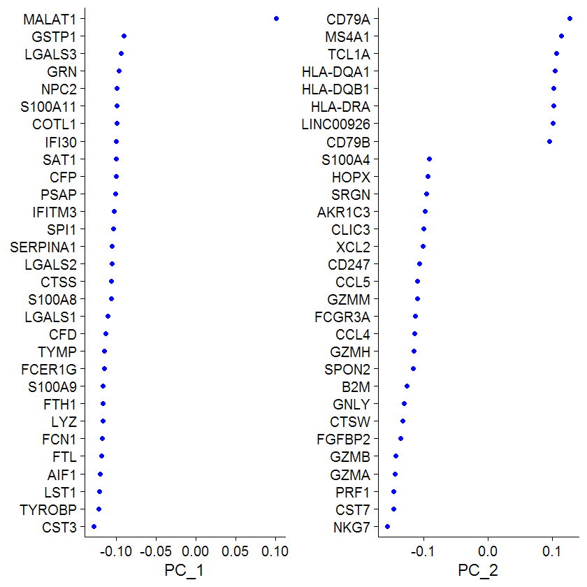
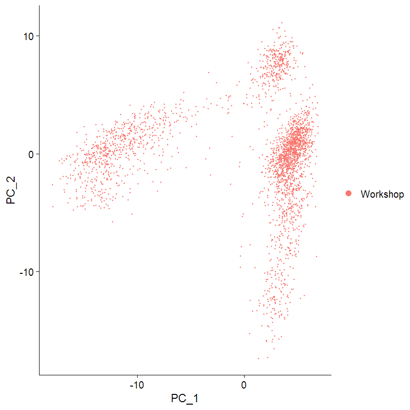
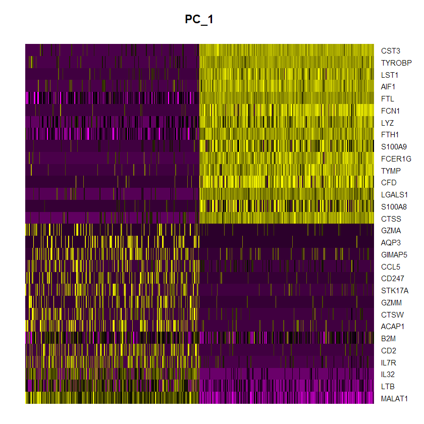
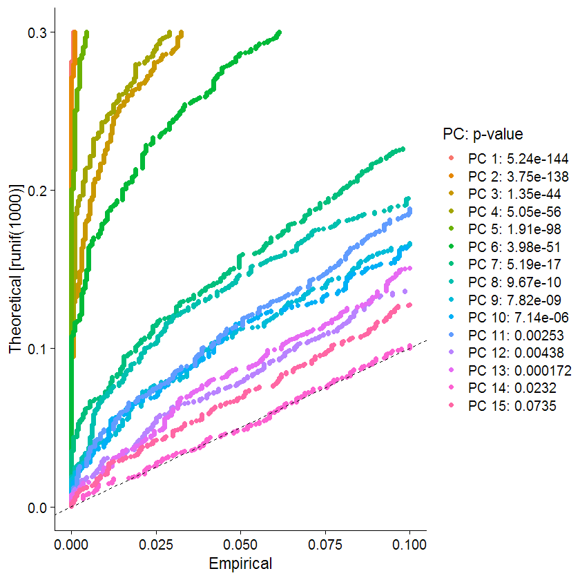
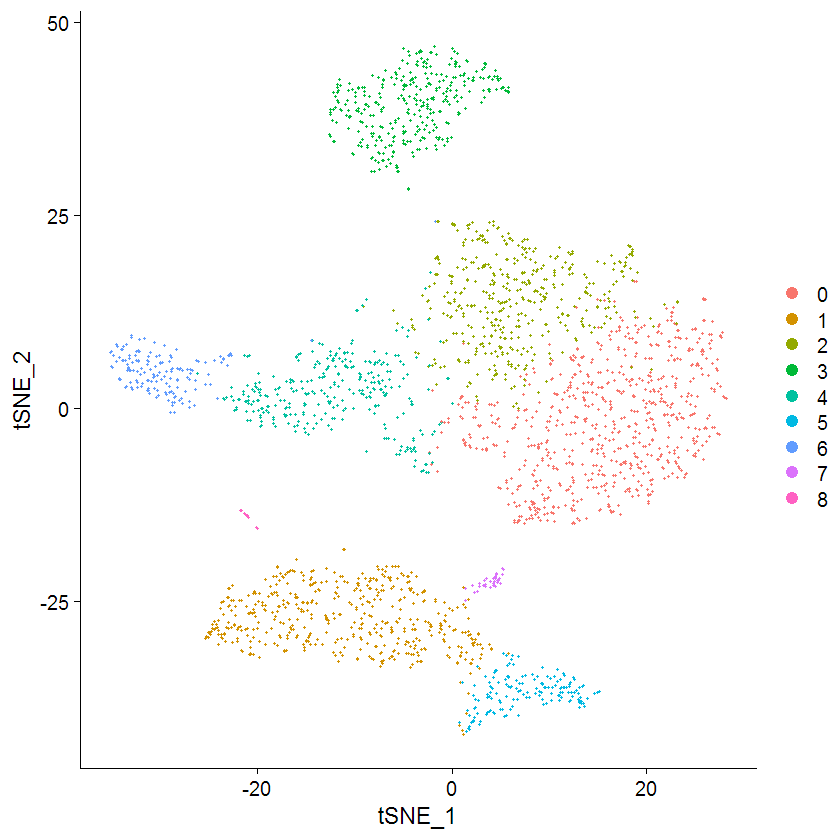
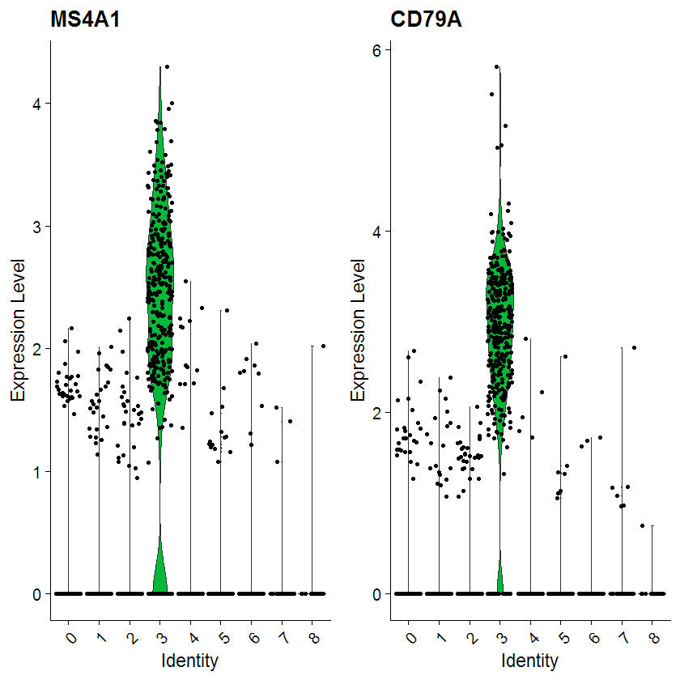
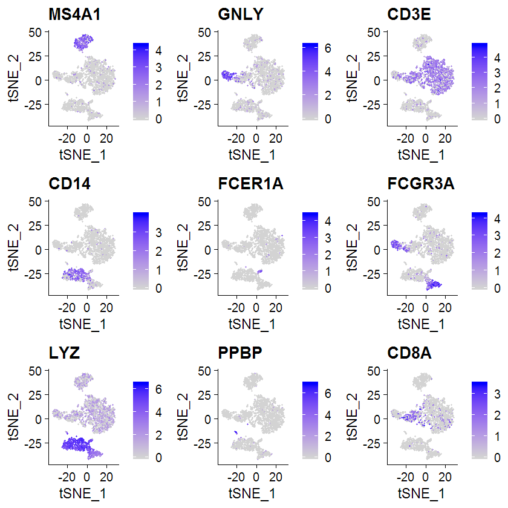

## 0. Introduction

This tutuorial is about how to use existing tools in R for RNA-seq data analysis. Because of the large memory requirement (>30GB) for doing a STAR alignment of RNA-Seq data, we will skip this step, and directly use results (alignment and gene counts) generated from STAR, as described in class. We have already prepared such as file, with gene counts for 6 samples (3 cases and 3 controls).

The exercise will be done in R, which is a language and environment for statistical computing and graphics. Some students probably do not have experience in R. Do not worry about it, because we will only use very simple commands to illustrate how the expression analysis works, and these commands are generally intuitive to understand.

The tutorial below assumes that we will use the cloud server for analysis. However, it is very possible that Rstudio can be batch installed and be available in every computer, and can be used in the local Windows desktop. If this is the case, then this makes visualization much easier, and we should try to use local Windows version of Rstudio for these exercises. Assuming that RStudio is indeed available in every computer, than we can open R studio, and transfer the necessary files `data/NB_vs_GBM.txt` from the cloud server to local computer for easier analysis. Most of the commands are identical below, except that you no longer ned to use conda to set up environment. Additionally, most of the generated figures can be directly visualized in a windows environment.


## 1. Preparation of directories and data files.

If you are using RStudio in Windows, then the steps below are not relevant. If you are using the cloud server, then follow the steps to create directory and activate conda environment.

1.1 `mkdir -p project/RNA-seq-tutorial` and `cd project/RNA-seq-tutorial` to create tutorial directory.

1.2 `ln -s /shared/data/RNA-seq-tutorial-data data` to link the data of gene counts for further analysis.

1.3 To use installed softwares, you need to run 
```
. /shared/miniconda3/etc/profile.d/conda.sh
conda activate base
```


## 2. Prepare R and data

The data analysis requires DESeq2 which is a tool that we described in class. It is already installed in cloud server so you should be able to use it directly. However, if you are using RStudio in local computer, you may need to install it yourself following instructions [here](https://bioconductor.org/packages/release/bioc/html/DESeq2.html).

The data analysis for differential genes will be conducted `DESeq2` in R. So, we will open the R and load `DSSeq2` and data for next step.
Simple type `R` and `Enter` to enter R software, and then under R,
```
library("DESeq2")
counts <- read.table("data/NB_vs_GBM.txt",header=TRUE,stringsAsFactors=TRUE)
rownames(counts) <- counts$Geneid
counts <- counts [ ,-1]
```

To see how the data look like, 
```
head(counts)
```
will outputs
```
      Geneid BJ024 BJ028 BJ030 PC112 PC123 PC124
1    DDX11L1     0     0     0     0     2     2
2     WASH7P   114   111   165    98   161   162
3 MIR1302-10   112    58    41   151   446   397
4    FAM138A     0     0     0     0     0     0
5    OR4G11P     0     0     0     0     0     0
6      OR4F5     0     0     0     0     0     0
```

## 3. Use `DeSeq2` for data analysis
3.1 Set the group conditions
```
columndata = data.frame(row.names = colnames(counts), condition = c("NB","NB","NB","GBM","GBM","GBM"), libtype = c("single-end","single-end","single-end","single-end","single-end","single-end"))
dds <- DESeqDataSetFromMatrix(countData = counts, colData = columndata, design =~ condition)
dds$condition <- factor(dds$condition, levels=c("NB","GBM"))
```

3.2 Get the results from `DeSeq2`
```
dds <- DESeq(dds)
res <- results(dds)
sortres <- res[order(res$padj),]
summary(res)
```
It might take several seconds, and then, the last line will output the summary of the results
```
out of 33296 with nonzero total read count
adjusted p-value < 0.1
LFC > 0 (up)     : 4699, 14%
LFC < 0 (down)   : 4767, 14%
outliers [1]     : 191, 0.57%
low counts [2]   : 10049, 30%
(mean count < 2)
[1] see 'cooksCutoff' argument of ?results
[2] see 'independentFiltering' argument of ?results
```

## 4. Plot the results and save them
4.1 Plot the results.
```
pdf("m_plotMA.pdf");
plotMA(res, main="DESeq2", ylim=c(-2,2))
dev.off()
```
The plot will be saved in `m_plotMA.pdf`.

Note that if you are using RStudio in your local Windows computer, you only need to run `plotMA(res, main="DESeq2", ylim=c(-2,2))`, and a window will pop up automatically with the figure as below:


4.2 Plot gene read counts
```
pdf("m_plotCounts.pdf");
plotCounts(dds, gene=which.min(res$padj), intgroup="condition")
dev.off()
```


4.3 Plot PCA
```
rld <- rlog(dds, blind=FALSE)
pdf("m_plotPCA.pdf");
plotPCA(rld, intgroup=c("condition", "libtype"))
dev.off()
```

4.4 Using `ggplot`
```
library(ggplot2)
data <- plotPCA(rld, intgroup=c("condition", "libtype"), returnData=TRUE)
percentVar <- round(100 * attr(data, "percentVar"))
pdf("m_plotPCA_ggplot.pdf");
ggplot(data, aes(PC1, PC2, color=condition, shape=libtype)) +
  geom_point(size=3) +
  xlab(paste0("PC1: ",percentVar[1],"% variance")) +
  ylab(paste0("PC2: ",percentVar[2],"% variance"))
dev.off()
```

4.5 Plot p-value distribution
```
pdf("m_hist.pdf");
hist(res$pvalue, br=20)
dev.off()
```

## 5. Save the results
```
write.csv(as.data.frame(sortres),file="NB_v_GBM.csv")
```
And you will find `NB_v_GBM.csv`.

After that, one needs to exit R by `Ctrl + D` and then `n` for `Save workspace image? [y/n/c]:`. And then,
```
awk -F ',' '{if(($3 > 1 || $3 < -1) && length($1)>2) print $1}' NB_v_GBM.csv  | head -101 | sed 's/\"//g' > NB_v_GBM.csv.top100_genes.txt
```
The top 100 genes with folder change > 2 (or < 0.5) will be output to `NB_v_GBM.csv.top100_genes.txt`. We can copy the gene list and paste to David, Enrichr, WebGestalt or other tools for Gene Ontology, pathway, and TF-target enrichment analyses.


## 6. (Optional) additional exercise

The above analysis compared 3 samples with normal tissue and cancer tissue, and many genes are expected to be differentially expressed. Next, as an optional exercise, we can compare 3 cell lines with gene knockdown versus 3 cell lines without knockdown, and see how the results change and how DESeq2 handles different experimental conditions.

The RNA-seq data that we will use here is from the paper [Noncoding RNA NORAD Regulates Genomic Stability by Sequestering PUMILIO Proteins](http://www.cell.com/cell/abstract/S0092-8674(15)01641-4). The cell line HCT116. The dataset is downloaded from NCBI SRA with the tools of edirect and fastq-dump.  We focus on DE genes between wide-type and NORAD knockout. There are 3 wild type data sets plus 3 NORAD knockout data sets. The analysis results from this paper can be found [here](https://github.com/WGLab/LabShare/files/567569/table.S3.xlsx). We re-processed the original FASTQ files by STAR and generated the `ReadsPerGene.tab` files used below.

The data are available at /shared/data/RNA-seq-tutorial-data, as `SRR2969247ReadsPerGene.tab` and so on. Note that this time we have counts for each file separately, and did not put them into a single file. You can use the command below to read these files, but you can also combine the files into one single file and read them.

```
sampleFiles <- c("SRR2969247_STAR/SRR2969247PerGene.out.tab",
                 "SRR2969248_STAR/SRR2969248PerGene.out.tab",
                 "SRR2969249_STAR/SRR2969249PerGene.out.tab",
                 "SRR2969250_STAR/SRR2969250PerGene.out.tab",
                 "SRR2969251_STAR/SRR2969251PerGene.out.tab",
                 "SRR2969252_STAR/SRR2969252PerGene.out.tab",
                 )
sampleCondition <- c("wt","wt","wt","k", "k","k")
sampleTable <- data.frame(sampleName = sampleFiles,
                          fileName = sampleFiles,
                          condition = sampleCondition)
ddsHTSeq <- DESeqDataSetFromHTSeqCount(sampleTable = sampleTable,
                                       directory = directory,
                                       design = ~ condition)
```


## 7. single-cell RNA-Seq data analysis

As previously mentioned, ideally we will also use Rstudio in local machines to perform analysis, because a few figures will be generated and it is much easier to view the results in local computer, rather than cloud server.

A note to RStudio users in Windows: For this exercise, two libraries are needed: dplyr and Seurat. If they cannot be loaded, then you need to do `install.packages("dplyr")` and `install.packages("Seurat")` in your Rstudio. Note that Seurat requires R version 3.4 or greater. If you see an error message such as "package ‘Seurat’ is not available (for R version 3.2.5)", then you need to update your R installation. The easiest way to open RGui, type `install.packages("installr")`, then `library(installr)`, then `updateR()`, then follow instructions and confirm update.

First, we need to load two R libraries that are required:

```
library(dplyr)
library(Seurat)
```

Next, we will load the PBMC single-cell data sets. The data set was a subset of the data sets generated by 10X Genomics as described [here](https://www.nature.com/articles/ncomms14049) and it was used by seurat tutorial. If you are using RStudio in local computer, you can adjust the path below accordingly (you can enter into a specific directory by `setwd("c:/Users/Kai Wang/Desktop/Data")`).

```
workshop.data <- Read10X(data.dir = "/shared/data/scRNA-Seq/Data")
```


Next, we want to initialize the Seurat object with the raw (non-normalized data).
```
Data <- CreateSeuratObject(counts = workshop.data, project = "Workshop", min.cells = 3, min.features = 200)
Data
```

You can see that "13714 features across 2700 samples within 1 assay". This tells us that there are expression data for 2700 single cells.

Now start with the standard pre-processing steps

Visualize QC metrics as a violin plot: 
```
VlnPlot(Data, features = c("nFeature_RNA", "nCount_RNA"), ncol = 2)
```

If using RStudio, you should see a figure like below immediately. Otherwise if using a terminal in the cloud server, you need to save the file as PDF or JPG and then FTP to local machine to view it.


We filter cells that have unique feature counts over 2,500 or less than 200
```
Data <- subset(Data, subset = nFeature_RNA > 200 & nFeature_RNA < 2500)
VlnPlot(Data, features = c("nFeature_RNA", "nCount_RNA"), ncol = 2)
```

## Normalizing the Data

Seurat employs a global-scaling normalization method "LogNormalize" that normalizes the feature expression measurements for each cell by the total expression, multiplies this by a scale factor (10,000 by default), and log-transforms the result.
```
Data <- NormalizeData(Data, normalization.method = "LogNormalize", scale.factor = 10000)
```

- Identification of highly variable features (feature selection)
```
Data <- FindVariableFeatures(Data, selection.method = "vst", nfeatures = 2000)
```

- plot variable features with and without labels
```
plot1 <- VariableFeaturePlot(Data)
CombinePlots(plots = list(plot1))
```

- Scaling the data
Here we shifts the expression of each gene, so that the mean expression across cells is 0, scales the expression of each gene, so that the variance across cells is 1 
```
all.genes <- rownames(Data)
Data <- ScaleData(Data, features = all.genes)
```

Next, we perform linear dimensional reduction (PCA)
```
Data <- RunPCA(Data, features = VariableFeatures(object = Data));
```


Seurat provides several useful ways of visualizing both cells and features that define the PCA
```
print(Data[["pca"]], dims = 1:5, nfeatures = 5)
VizDimLoadings(Data, dims = 1:2, reduction = "pca")
DimPlot(Data, reduction = "pca")
DimHeatmap(Data, dims = 1, cells = 500, balanced = TRUE)
```

Some examples are below:





- Determine the 'dimensionality' of the dataset
Seurat clusters cells based on their PCA scores. Seurat uses a heuristic method to determine the number of components for the clustering stage. Note that this step may take some time depending on the speed of the local computer or cloud server.

```
Data <- JackStraw(Data, num.replicate = 100)
Data <- ScoreJackStraw(Data, dims = 1:20)
JackStrawPlot(Data, dims = 1:15)
```

An example plot is shown below:



## Cluster the cells

```
Data <- FindNeighbors(Data, dims = 1:10)
Data <- FindClusters(Data, resolution = 0.5)
```

- Run non-linear dimensional reduction (UMAP/tSNE)
- To install UMAP, you can do so via reticulate::py_install(packages ='umap-learn')
```
Data <- RunTSNE(Data, dims = 1:10)
DimPlot(Data, reduction = "tsne")
```

An example plot is shown below:



Note that tSNE results are not reproducible without a PCA initialization [citation](https://www.biorxiv.org/content/biorxiv/early/2018/10/25/453449.full.pdf), so you may want to explore pca first before running tSNE.

- Finding differentially expressed features (cluster biomarkers)
- find all markers of cluster 1
```
cluster1.markers <- FindMarkers(Data, ident.1 = 1, min.pct = 0.25)
head(cluster1.markers, n = 5)
```

- find all markers distinguishing cluster 5 from clusters 0 and 3

```
cluster5.markers <- FindMarkers(Data, ident.1 = 5, ident.2 = c(0, 3), min.pct = 0.25)
head(cluster5.markers, n = 5)
VlnPlot(Data, features = c("MS4A1", "CD79A"))
FeaturePlot(Data, features = c("MS4A1", "GNLY", "CD3E", "CD14", "FCER1A", "FCGR3A", "LYZ", "PPBP",  "CD8A"))
```

We will see how the specific genes are highly enriched in one cluster versus the other clusters:




Note that the above procedures represent a simplified workflow of what was described originally from the developers [here](https://satijalab.org/seurat/v3.0/pbmc3k_tutorial.html). Some slightly more advanced tutorials can be found [here](https://satijalab.org/seurat/vignettes.html) if you are interested to tackle more challenges.

While you are following the tutorial, it is a good idea to save some intermediate results such as figures and plots, which can be compiled later in to a Word document to help understand what analysis was done today, and what new information you learned from this exercise.

## After the tutorial

If you are using the terminal in cloud server, to do other tutorial, you might need to run `conda deactivate` to go back to the base environment for other projects. ***If you still have issues to run other projects, please re-login.***

